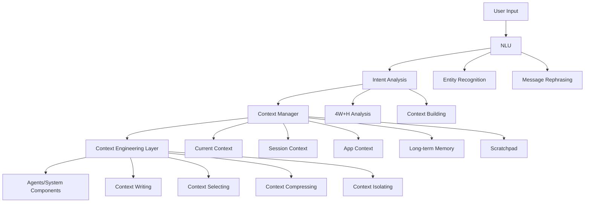
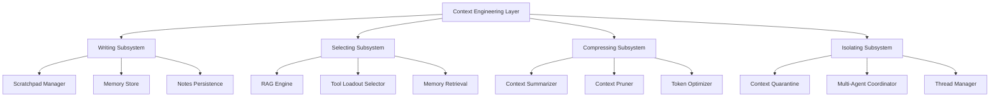

# Context-Aware System Design

## 1. System Overview

A context-aware system that manages and distributes context for AI agents and system components, implementing **context engineering** principles to fill context windows with just the right information at each step. The system addresses context failures through strategic context management techniques.

### 1.1 Context Engineering Principles

Context engineering is the art and science of filling the context window with just the right information at each step of an agent's trajectory. This involves four core strategies:

- **Writing Context**: Saving information outside the context window (scratchpads, memories)
- **Selecting Context**: Pulling relevant information into the context window (RAG, tool selection)
- **Compressing Context**: Retaining only required tokens (summarization, pruning)
- **Isolating Context**: Splitting context across separate threads (multi-agent, quarantine)

### 1.2 Context Failure Mitigation

The system addresses common context failures:

- **Context Poisoning**: Hallucinations propagating through context
- **Context Distraction**: Over-focus on context at expense of training knowledge
- **Context Confusion**: Superfluous information degrading responses
- **Context Clash**: Conflicting information within context

## 2. Architecture Components

### 2.1 Enhanced Processing Flow

### 2.2 Context Engineering Layer

### 2.3 Enhanced Context Structure

```mermaid
flowchart TD
    A[Context Types] --> B[App Context]
    A --> C[Session Context]
    A --> D[Current Context]
    A --> E[User Context]
    A --> F[Long-term Memory]
    A --> G[Scratchpad]
    
    B --> B1[Available Tools]
    B --> B2[Agent Configurations]
    B --> B3[System Settings]
    B --> B4[Tool Loadout Rules]
    
    C --> C1[Chat History]
    C --> C2[Short-term Memory]
    C --> C3[Recent Operations]
    C --> C4[Session Scratchpad]
    
    D --> D1[Intent Analysis]
    D --> D2[NLU Understanding]
    D --> D3[Active Task]
    D --> D4[Context Window State]
    
    E --> E1[User Profile]
    E --> E2[Preferences]
    E --> E3[Role Context]
    
    F --> F1[Episodic Memories]
    F --> F2[Procedural Memories]
    F --> F3[Semantic Memories]
    
    G --> G1[Task Notes]
    G --> G2[Intermediate Results]
    G --> G3[Planning State]
```

## 3. Core Components

### 3.1 Context Manager
Central orchestrator that maintains different context types and coordinates with the Context Engineering Layer for optimization.

**Key Responsibilities:**
- Manage app, session, current, and user contexts
- Interface with long-term memory and scratchpad systems
- Coordinate context engineering operations
- Handle context access requests from agents and system components

### 3.2 Context Engineering Layer
Strategic optimization layer that applies the four core context engineering strategies.

**Key Responsibilities:**
- **Writing Operations**: Persist context to external storage systems
- **Selecting Operations**: Retrieve and filter relevant context for tasks
- **Compressing Operations**: Reduce context size while preserving essential information
- **Isolating Operations**: Separate context across multiple threads or agents

### 3.3 Writing Subsystem
Handles context persistence outside the main context window.

**Key Capabilities:**
- **Scratchpad Management**: Task-specific notes and intermediate results
- **Memory Classification**: Categorize information into episodic, procedural, and semantic memories
- **Session Persistence**: Maintain context across interaction sessions
- **External Storage**: Interface with databases and file systems

### 3.4 Selecting Subsystem
Intelligently retrieves relevant context for specific tasks.

**Key Capabilities:**
- **Tool Selection**: RAG-based tool loadout optimization with critical thresholds
- **Memory Retrieval**: Semantic search across different memory types
- **Knowledge Filtering**: Relevance-based information selection
- **Context Prioritization**: Importance-based context ranking

### 3.5 Compressing Subsystem
Reduces context size while maintaining essential information.

**Key Capabilities:**
- **Summarization**: Condense chat history and documents
- **Pruning**: Remove irrelevant content using lightweight models
- **Token Optimization**: Manage token budgets across different model types
- **Selective Compression**: Preserve critical instructions and current task context

### 3.6 Isolating Subsystem
Manages context separation across multiple execution threads.

**Key Capabilities:**
- **Multi-Agent Coordination**: Distribute context across specialized agents
- **Context Quarantine**: Isolate potentially problematic content
- **Thread Management**: Maintain separate context spaces for parallel tasks
- **Conflict Resolution**: Handle context clashes through priority rules

## 4. Context Failure Detection and Mitigation

### 4.1 Context Health Monitoring
Continuous assessment system that monitors context quality and identifies potential failures.

**Monitoring Dimensions:**
- **Poisoning Detection**: Identify hallucinations and false information propagation
- **Distraction Assessment**: Measure over-reliance on context vs. training knowledge
- **Confusion Analysis**: Detect superfluous information degrading responses
- **Clash Identification**: Find conflicting information within context

**Health Metrics:**
- Context window utilization rates
- Information relevance scores
- Factual consistency measurements
- Conflict detection algorithms

### 4.2 Adaptive Context Management
Dynamic adjustment system that modifies context strategies based on health assessments.

**Adaptive Strategies:**
- **Poisoning Mitigation**: Validate against external sources, quarantine suspicious content
- **Distraction Mitigation**: Force compression, move non-critical information to external storage
- **Confusion Mitigation**: Apply stricter relevance criteria, re-run selection processes
- **Clash Mitigation**: Implement conflict resolution through priority rules

## 5. Practical Implementation Strategies

### 5.1 Tool Loadout Management
Strategic tool selection system that prevents context overload.

**Solution Approach:**
- **Critical Thresholds**: 30 tools for large models, 19 for smaller models
- **RAG-Based Selection**: Semantic matching of tools to task requirements
- **Dynamic Loadout**: Task-specific tool configurations
- **Performance Optimization**: 3x improvement in tool selection accuracy

### 5.2 Memory Management System
Intelligent memory lifecycle management based on importance and utility.

**Solution Approach:**
- **Importance Rating**: Weighted scoring based on specificity, actionability, and recency
- **Lifecycle Management**: Archive low-importance memories, compress medium-importance ones
- **Memory Types**: Distinct handling for episodic, procedural, and semantic memories
- **Cleanup Strategies**: Periodic maintenance based on usage patterns

### 5.3 Context Window Optimization
Model-specific optimization strategies for different context window sizes.

**Solution Approach:**
- **Token Budgets**: 80% capacity for normal operation, compress at 90%
- **Model-Specific Thresholds**: Different limits for small (8K), medium (32K), large (128K), and XL (1M) models
- **Progressive Optimization**: Layer multiple optimization strategies as needed
- **Performance Monitoring**: Track optimization effectiveness and adjust strategies

## 6. Access Mechanisms

### 6.1 Agent Access Pattern
Tool-based access system that provides controlled context access for agents.

**Design Principles:**
- Limited context access through specialized tools
- Task-specific context filtering
- Controlled information exposure
- Integration with agent system messages

### 6.2 System Access Pattern
Direct access system for non-agent system components.

**Design Principles:**
- Full context section access for system components
- Structured request/response patterns
- Component-specific context customization
- Efficient bulk context operations

## 7. Best Practices Framework

### 7.1 Context Engineering Guidelines

#### **Writing Context Strategy**
- **Scratchpad Usage**: Task-specific notes during agent execution
- **Memory Classification**: Episodic examples, procedural rules, semantic facts
- **Persistence Strategy**: External storage for non-immediate context
- **Lifecycle Management**: Importance-based retention and cleanup

#### **Selecting Context Strategy**
- **RAG Application**: Tool descriptions, knowledge base, memory retrieval
- **Relevance Filtering**: Strict criteria for task-specific information
- **Priority Systems**: Recent and high-importance information first
- **Threshold Management**: Critical limits for different component types

#### **Compressing Context Strategy**
- **Summarization Rules**: >10 messages triggers summary, keep last 5 full
- **Pruning Techniques**: Lightweight models for irrelevant content removal
- **Token Management**: Model-specific capacity optimization
- **Preservation Priorities**: Critical instructions and current task context

#### **Isolating Context Strategy**
- **Multi-Agent Deployment**: >3 independent subtasks benefit from isolation
- **Quarantine Protocols**: Potentially problematic content separation
- **Thread Management**: Parallel exploration with dedicated contexts
- **Conflict Resolution**: Priority-based information reconciliation

### 7.2 Context Health Management

#### **Monitoring Framework**
- **Automated Metrics**: Continuous health assessment
- **Usage Tracking**: Token utilization and context window efficiency
- **Failure Detection**: Early warning systems for context problems
- **Performance Analytics**: Context strategy effectiveness measurement

#### **Adaptive Management**
- **Dynamic Adjustment**: Real-time strategy modification based on health
- **Failsafe Mechanisms**: Automatic fallback when context health degrades
- **Recovery Protocols**: Context rollback and restoration capabilities
- **Progressive Restriction**: Graduated response to context stress

### 7.3 Performance Optimization

#### **Efficiency Strategies**
- **Batch Operations**: Group context operations for efficiency
- **Lazy Loading**: On-demand context component loading
- **Caching Systems**: Frequently accessed information optimization
- **Token Efficiency**: Smart compression and selection algorithms

#### **Scalability Approaches**
- **Horizontal Scaling**: Distributed context management
- **Sharding Strategies**: Large-scale context distribution
- **Async Operations**: Non-blocking context I/O
- **Metrics Collection**: Performance monitoring and optimization

## 8. Future Enhancements

### 8.1 Advanced Context Engineering

1. **Intelligent Context Scheduling**
   - Predictive context loading based on usage patterns
   - Dynamic context window allocation optimization
   - Context prefetching for anticipated task needs

2. **Context Quality Assurance**
   - Automated context validation systems
   - A/B testing frameworks for context optimization
   - Quality metrics and performance dashboards

3. **Adaptive Context Strategies**
   - Machine learning-based context optimization
   - Personalized context management patterns
   - Context strategy evolution based on outcomes

### 8.2 Integration and Tooling

1. **Development Tools**
   - Context engineering IDE extensions
   - Real-time context visualization tools
   - Context debugging and profiling capabilities

2. **Monitoring and Analytics**
   - Context usage analytics platforms
   - Performance impact analysis tools
   - Context optimization recommendation systems

3. **Integration Framework**
   - Standardized context management APIs
   - Cross-system context sharing protocols
   - Context synchronization mechanisms