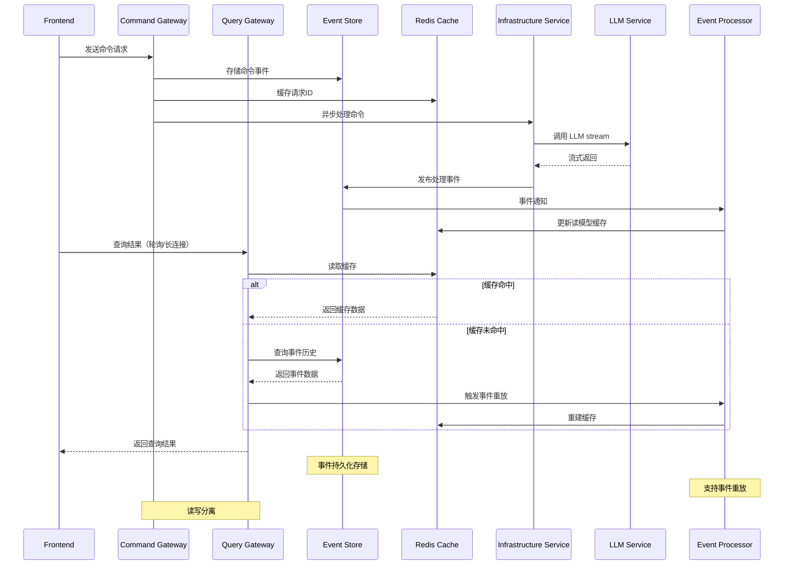

# 方案 3：事件驱动 + CQRS模式方案

## 架构特点
- 命令与查询分离，提高系统性能
- 事件溯源保证数据一致性
- 多级缓存策略
- 支持事件重放和补偿

## 架构组件说明

### Command Gateway（命令网关）
- 处理所有写操作
- 验证命令有效性
- 发布命令事件

### Query Gateway（查询网关）
- 处理所有读操作
- 优先从缓存读取
- 支持事件重放构建视图

### Event Store（事件存储）
- 持久化所有事件
- 支持事件溯源
- 提供事件重放能力

### Event Processor（事件处理器）
- 消费事件更新读模型
- 处理事件补偿逻辑
- 维护最终一致性

## 优势
1. **高性能**：读写分离，查询走缓存
2. **可追溯**：完整的事件历史记录
3. **容错性**：事件重放恢复数据
4. **扩展性**：命令和查询独立扩展
5. **一致性**：事件驱动保证最终一致性

## 断连恢复机制
1. **客户端断连**：
   - 重连后通过查询网关获取最新状态
   - 基于事件ID进行增量同步

2. **服务端故障**：
   - 事件存储保证数据不丢失
   - 重启后自动重放未处理事件
   - 支持补偿事务处理失败场景

3. **LLM服务异常**：
   - 命令进入重试队列
   - 支持熔断和降级策略
   - 异步补偿机制
