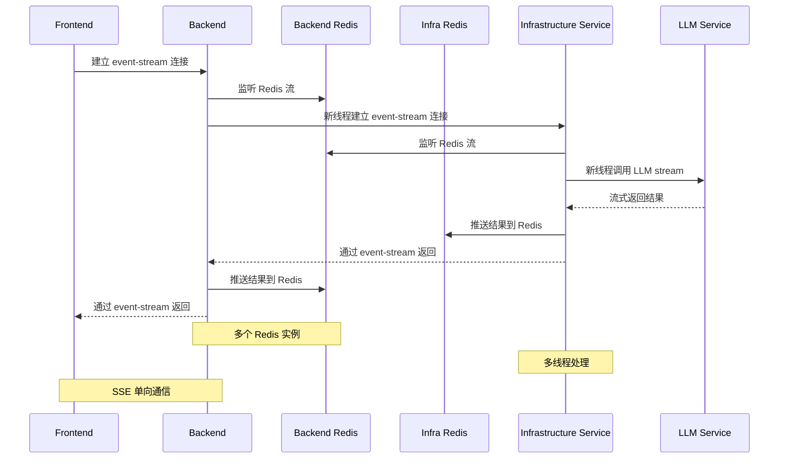

# 现有架构方案

## 架构特点
- Frontend 和 Backend 之间通过 event-stream (SSE) 连接
- Backend 直接监听 Redis 流
- Infrastructure Service 与 Backend Redis 和 Infra Redis 都有交互
- 存在多个 Redis 实例（Backend Redis 和 Infra Redis）

## 现有架构问题分析

### 1. 连接管理问题
- **SSE 单向限制**：event-stream 只支持服务端推送，无法进行双向通信
- **断连检测延迟**：SSE 断连检测不够及时，可能导致消息丢失
- **重连机制缺失**：客户端断连后需要手动处理重连逻辑

### 2. 数据一致性问题
- **多 Redis 实例**：Backend Redis 和 Infra Redis 之间数据同步可能不一致
- **无事务保证**：跨服务操作没有事务性保证
- **状态追踪困难**：难以追踪请求在各个服务间的处理状态

### 3. 性能瓶颈
- **同步阻塞**：多处使用同步监听，可能造成线程阻塞
- **资源浪费**：多线程创建和管理开销大
- **缺少缓存策略**：没有有效的缓存机制减少重复请求

### 4. 容错性不足
- **单点故障**：任一服务故障都会影响整个流程
- **无降级策略**：LLM 服务不可用时没有备选方案
- **错误恢复困难**：发生错误后难以从断点恢复

## 断连场景处理能力

| 断连场景 | 现有架构表现 | 影响程度 |
|---------|------------|---------|
| Frontend 断连 | 消息丢失，需要完全重新请求 | 高 |
| Backend 崩溃 | 所有客户端连接中断 | 极高 |
| Redis 故障 | 服务间通信中断 | 极高 |
| Infrastructure Service 故障 | 无法处理新请求 | 高 |
| LLM Service 超时 | 请求超时，无重试机制 | 中 |
| 网络抖动 | 可能导致部分消息丢失 | 中 |

## 监控和调试挑战

1. **链路追踪困难**：请求经过多个服务，难以完整追踪
2. **日志分散**：各服务日志独立，问题定位困难
3. **性能监控缺失**：缺少统一的性能指标收集
4. **错误上报不完整**：错误信息可能在某个环节丢失
