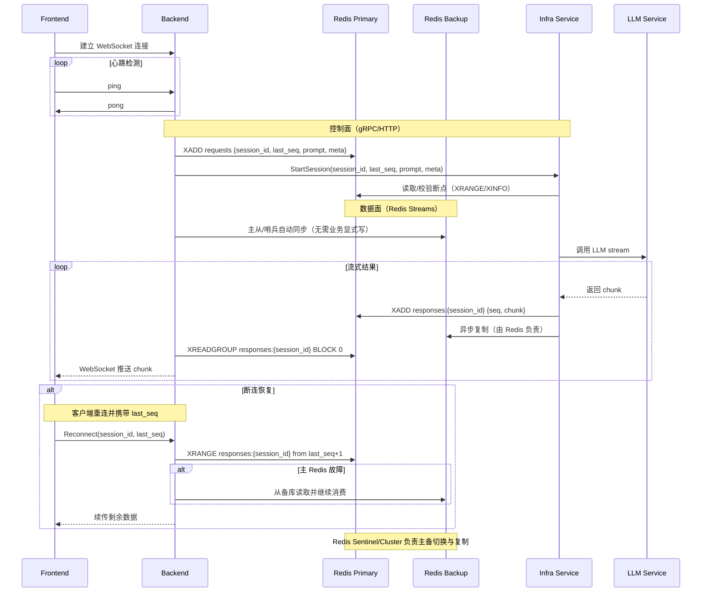

# 方案 2：双Redis缓存 + WebSocket心跳方案（加注控制面/数据面）

## 架构特点
- 主备双Redis提供高可用性（建议 Redis Streams 实现有序流 + 消费组）
- WebSocket 替代 SSE，支持双向通信和心跳保活
- 基于序列号（seq）的断点续传机制
- 明确区分 控制面（Backend⇄Infra 的指令） 与 数据面（结果流转）

## 通信通道说明
- 控制面（Backend ⇄ Infra）：建议使用 gRPC（或 HTTP+重试）
  - StartSession(session_id, last_seq, prompt, meta)
  - CancelSession(session_id)、Heartbeat(session_id)（可选）
- 数据面（Infra → Backend）：通过 Redis Streams（responses:{session_id}）进行结果传输；Backend 用消费组阻塞读取并推送给前端。

## 优势
1. **高可用性**：双Redis提供故障转移能力
2. **实时性**：WebSocket双向通信，心跳保活
3. **断点续传**：基于序列号从断点位置恢复传输
4. **数据完整性**：Streams + 消费组保证顺序与至少一次投递

## 断连处理策略
- **连接层**：WebSocket 自动重连 + 心跳检测
- **缓存/队列层**：Redis 主备切换，结果流不丢失
- **应用层**：基于 last_seq 的断点续传
- **降级策略**：LLM 服务不可用时，返回最新可用片段/缓存或提示稍后重试
