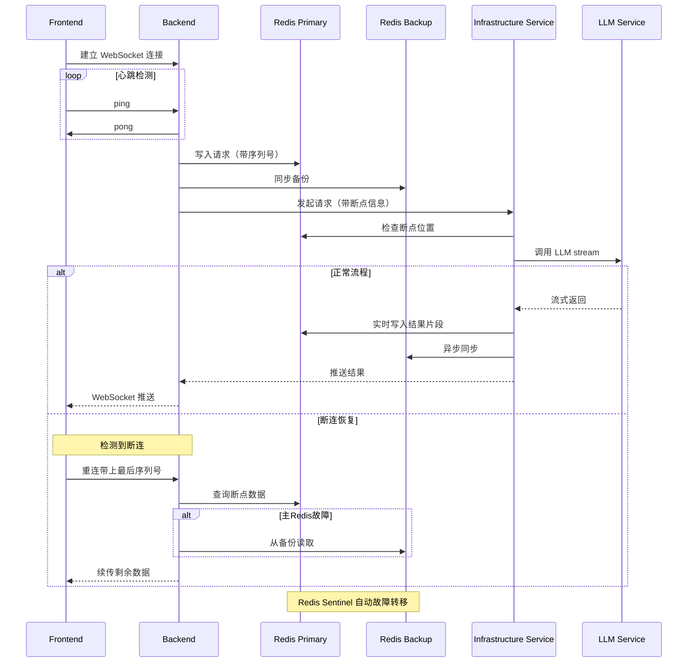

# 方案 2：双Redis缓存 + WebSocket心跳方案

## 架构特点
- 主备双Redis提供高可用性
- WebSocket替代SSE，支持双向通信和心跳
- 断点续传机制

## 优势
1. **高可用性**：双Redis提供故障转移能力
2. **实时性**：WebSocket双向通信，心跳保活
3. **断点续传**：支持从断点位置恢复传输
4. **数据完整性**：序列号机制保证数据顺序和完整性

## 断连处理策略
- **连接层**：WebSocket自动重连，心跳检测
- **缓存层**：主备自动切换，数据不丢失
- **应用层**：基于序列号的断点续传
- **降级策略**：LLM服务不可用时返回缓存结果
