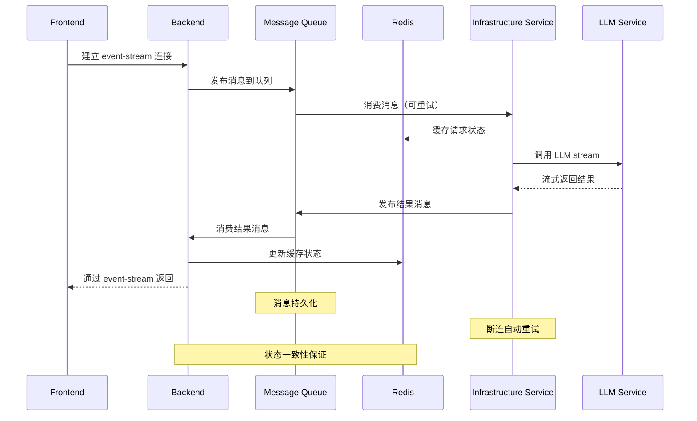

# 方案 1：消息队列解耦方案

## 架构特点
- 引入消息队列作为中间件，解耦服务间依赖
- 支持消息持久化，防止数据丢失
- 实现重试机制和死信队列处理

## 优势
1. **解耦性**：服务间通过消息队列异步通信，降低耦合度
2. **可靠性**：消息持久化，支持重试机制
3. **扩展性**：易于横向扩展，支持多消费者
4. **容错性**：某个服务宕机不影响消息处理，恢复后可继续处理

## 断连处理
- Frontend 断连：消息继续在队列中处理，重连后获取结果
- LLM Service 断连：消息重试，自动切换到备用服务
- 消息队列本身具有集群容错能力
