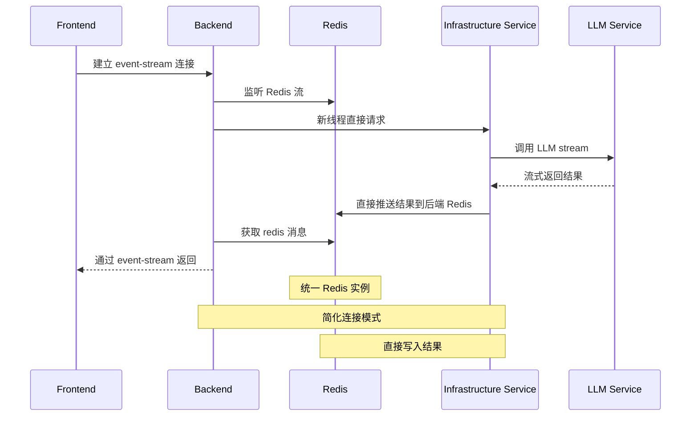

# 您的优化方案

## 架构特点
- 简化了 Redis 实例，统一使用单个 Redis
- Backend 新线程直接请求 Infrastructure Service
- 减少了服务间的 event-stream 连接
- Infrastructure Service 直接推送结果到后端 Redis

## 优化改进点

### 1. 架构简化
- **Redis 统一**：合并为单一 Redis 实例，降低复杂度
- **连接简化**：减少 event-stream 连接数量
- **流程优化**：Infrastructure Service 直接写入 Backend Redis

### 2. 性能提升
- **减少中转**：结果直接写入 Redis，减少传输环节
- **降低延迟**：简化的流程带来更低的延迟
- **资源优化**：减少线程和连接数量

### 3. 部分问题改善
- **维护简化**：单一 Redis 实例更容易管理
- **调试方便**：流程简化后更容易追踪问题
- **部署简单**：减少组件数量，部署更简单

## 仍存在的挑战

| 问题类别 | 具体问题 | 严重程度 |
|---------|---------|---------|
| 断连恢复 | 仍然缺少完善的断连恢复机制 | 高 |
| 容错性 | Redis 单点故障风险 | 高 |
| 监控 | 缺少统一的监控和追踪 | 中 |
| 扩展性 | 服务间仍有一定耦合 | 中 |
| 重试机制 | 没有自动重试逻辑 | 中 |
