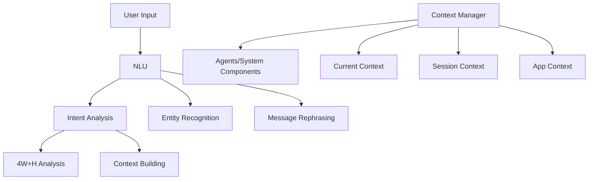
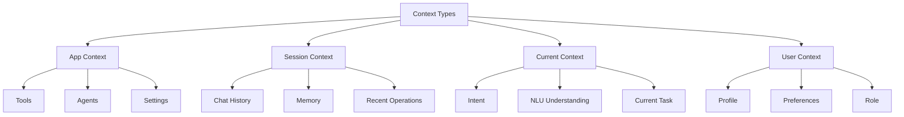
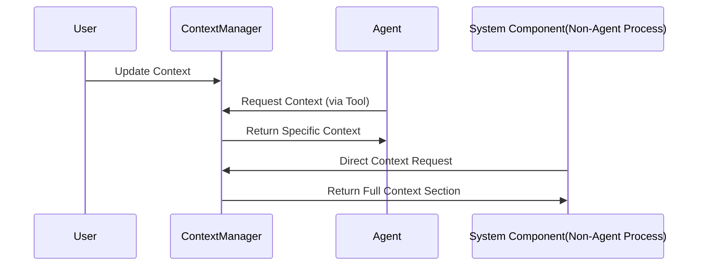
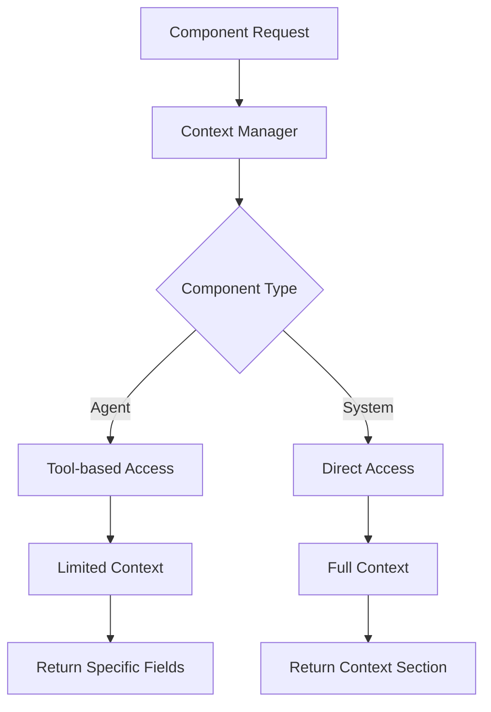

# Context-Aware System Design

## 1. System Overview

A context-aware system that manages and distributes context for AI agents and system components, with clear separation between NLU, Intent Analysis, and Context Management.

## 2. Architecture Components

### 2.1 Processing Flow


### 2.2 Context Structure


### 2.3 Context Flow


### 2.4 Context Retrieval System


## 3. Core Components

### 3.1 Context Manager
```python
class ContextManager:
    def __init__(self):
        self.app_context = {
            'tools': {},
            'agents': {},
            'settings': {}
        }
        self.session_context = {
            'chat_history': [],
            'memory': {},
            'recent_operations': []
        }
        self.current_context = {
            'intent': None,
            'nlu': None,
            'task': None
        }
        self.user_context = {
            'profile': {},
            'preferences': {},
            'role': None
        }
```

### 3.2 Context Access Patterns
```python
class ContextRequest(BaseModel):
    context_types: list[ContextType]
    component_name: str
    component_type: ComponentType

class GetContextTool:
    """Tool for agents to access context"""
    async def __call__(
        self,
        context_types: list[str],
        component_name: str
    ) -> dict:
        return await self.context_manager.get_context_for_agent(...)
```

## 4. Access Mechanisms

### 4.1 Agent Access (Tool-based)
```python
# Via tool in agent system message
async def execute_task(self):
    context = await self.get_context(
        context_types=["current", "session"],
        component_name=self.name
    )
    # Use context in task execution
```

### 4.2 System Access (Direct)
```python
# Direct access for system components
async def process_request(self):
    context = await self.context_manager.get_context_for_system(
        ContextRequest(
            context_types=[ContextType.APP, ContextType.CURRENT],
            component_name="planner",
            component_type=ComponentType.SYSTEM
        )
    )
```

## 5. Context Updates

### 5.1 Update Mechanisms
```python
# Update current context
await context_manager.update_current_context({
    'intent': intent_result,
    'nlu': nlu_result,
    'task': current_task
})

# Update session context
await context_manager.update_session_context({
    'chat_history': updated_history,
    'memory': new_memory
})
```

### 5.2 Synchronization Rules
- Current Context: Real-time updates
- Session Context: Per interaction updates
- App Context: Configuration-based updates
- User Context: Profile-based updates

## 6. Integration Points

### 6.1 With NLU
```python
class NLU:
    async def process(self, message: str):
        entities = self.extract_entities(message)
        rephrased = self.rephrase_message(message)
        return NLUResult(entities=entities, rephrased=rephrased)
```

### 6.2 With Intent Analysis
```python
class IntentAnalyzer:
    async def analyze(self, nlu_result: NLU) -> Intent:
        return Intent(...)
```

### 6.3 With Agents
```python
def configure_agent(context_manager: ContextManager) -> Agent:
    return Agent(
        tools=[
            context_manager.get_context_tool(),
            # other tools...
        ],
        system_message="Use context tool for context-aware operations..."
    )
```

## 7. Best Practices

### 7.1 Context Requests
- Request minimum required context
- Use appropriate access pattern
- Handle missing context gracefully

### 7.2 Context Updates
- Atomic updates
- Validation before update
- Maintain consistency

### 7.3 Error Handling
- Graceful degradation
- Fallback values
- Clear error messages


### 7.4 **Context Access**
   - Components should only access required context
   - Use tool-based access for agents
   - Direct access for system components

### 7.5 **Memory Management**
   - Rate memories based on specificity and actionability
   - Preserve high-rated memories longer
   - Clean up low-rated memories periodically

### 7.6 **Intent Analysis**
   - Single LLM call for complete analysis
   - Structured output with 4W+H
   - Memory rating integration

## 8. Future Enhancements

1. **Performance**
   - Context caching
   - Lazy loading
   - Batch updates

2. **Monitoring**
   - Usage analytics
   - Access patterns
   - Performance metrics

3. **Security**
   - Access control
   - Context validation
   - Audit logging