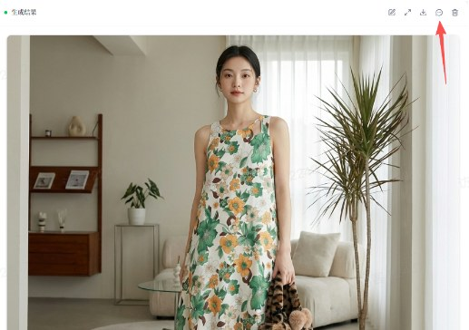
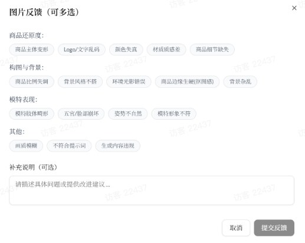

# 卖倍 AI 产品介绍

Source: https://ecnaj5aj95hg.feishu.cn/wiki/JFx8wmc8Ti8CN1ku851cVNkunCe
Modified: 2026-04-22T06:52:52.000Z

## 卖倍 AI 是什么？

卖倍 AI（https://maibei.maybe.ai） 是电商商家的全能型数字增长团队，集 AI 作图、 AI 修图、AI 视频生成、AI 数据处理与 AI 营销文案于一体。

它不仅能帮助卖家实现一键本土化修图和短视频低成本量产，还能通过自动化对账与市场趋势分析解决运营中的效率及决策难题。

卖倍 AI 用一个智能系统彻底重塑你的电商工作流，让你的生意不止做对，更要翻倍。

### 我们支持多品类，也欢迎你来深度测试！

✅ 覆盖品类广：服装、箱包、家具、美妆日用、鞋袜、家居等主流电商类目，我们都已实测优化。

✅ 免费帮你出图和视频：

- 只要提供你的产品图片（白底图/实拍图均可）以及参考风格（作图或视频）。

- 我们免费为你制作 1–2 套 AI 生成的主图 + 场景图 + 短视频，让你亲自感受效果。

✅ 你的反馈，让工具更懂你：

- 收到作品后，欢迎告诉我们哪里好、哪里要调整（比如模特姿势、商品细节、色调偏好、风格类型等）。

- 我们会基于你的反馈优化更符合要求的生成逻辑，让后续效果更贴合你的品类和需求。

✅ 有个性化需求？我们免费支持！

- 可免费提供针对性调试服务以及制作批量自动化工作流——👇添加卖倍 AI 客服微信，直接沟通，快速出样 。

扫码查看视频号更多案例

## 卖倍 AI 适用客户群体

### AI 生图、生视频、批量生成文案

<table>
<tr>
<td >适用客户群体</td>
<td >卖倍 AI服务</td>
<td >核心需求</td>
</tr>
<tr>
<td >实体档口/批发商卖家</td>
<td >模特上身效果图</td>
<td >- 批量将人台图快速生成模特上身效果图</td>
</tr>
<tr>
<td rowspan="3">跨境电商卖家 国内电商卖家</td>
<td >商品主图/详情图/细节图/场景图/多视角图/尺码图等</td>
<td >- 生成指定身材、人种的外模图，满足跨境电商本地化需求 - 一键生成全套素材(主图+场景图+细节图+模特图+视频)，快速完成商品上架和测款 - 节约模拍成本，无需等货和安排拍摄场地</td>
</tr>
<tr>
<td >&nbsp;</td>
<td >商品买家秀</td>
<td >- 低成本生成有氛围感、真实感的买家秀,提升转化率</td>
</tr>
<tr>
<td >&nbsp;</td>
<td >商品短视频营销/推广素材 （适用于Tiktok、小红书、抖音等）</td>
<td >- 拆解爆款视频脚本,学习优秀案例的创作逻辑 - 仿爆款视频,快速复刻爆款的带货视频 - 一键生成种草视频/商品动图，降低制作成本 - 自动配置多语言口播+本土化字幕</td>
</tr>
<tr>
<td >电商运营</td>
<td >素材优化与调整</td>
<td >- 灵活修改素材细节，快速测款: - 一键换模特(不同肤色、国家、身材) - 商品换颜色、换背景 - 商品抠图、去水印、调整尺寸等 - 快速调整，无需等美工修改</td>
</tr>
<tr>
<td >平台卖家/运营/独立站卖家</td>
<td >批量生成/优化商品文案、博客文章等</td>
<td >- 批量优化产品标题、详情描述、图片文案 - 批量生成营销文案、博客文章 - 内置平台优化规则与卖家定制规则，符合SEO和平台要求</td>
</tr>
</table>

### AI 数据处理与自动化工作流

<table>
<tr>
<td >适用客户群体</td>
<td >卖倍 AI服务</td>
<td >核心需求</td>
</tr>
<tr>
<td >有多店铺/多平台/多SKU的卖家 运营团队</td>
<td >自动化多维度多渠道运营数据分析 - 流量数据 - 推广数据 - 订单数据 - 库存数据 - SKU数据 - ……</td>
<td >- 告别手工取数和vlookup等公式地狱 - API/RPA自动获取所有数据→按你的规则自动整合清洗数据→一键生成综合报表→AI给出分析建议 - 识别问题SKU和机会SKU - 主图优化(如&quot;红色款转化率高,建议主图优先展示&quot;) - 滞销预警和下架建议 - 智能备货计划，减少库存积压和断货风险 - 其他</td>
</tr>
</table>

## 能给商家带来什么？

### 1. 一张图，出全套素材

- 白底图进，15 张营销图出。 多国模特图、场景图、细节图、多角度图。 10 分钟完成，原本要 3 天。

- 内置品类、平台、国家文化最佳实践，仅需点选，无需复杂描述，即可生成高转化图片。

- 不只是省拍摄费。 是让你有能力快速测试不同视觉方案。 不用等摄影师档期，不用重拍。

### 2. 抄款不用等货

- 看到竞品爆款？ 把你的产品 P 进去。快速生成热卖图。

- 上架测款，数据好再备货。 降低试错成本。

### 3. 视频不求人

- 几张图自动生成爆款短视频。 支持多语言配音、字幕。

- 不是替代专业团队。 是让你在没有团队之前就能开始获取流量。

### 4. 看懂竞品在卖什么

- 自动抓取竞品差评。 告诉你用户真正在意什么。

- 不是替你选品。 是帮你找到差异化切入点。

### 5. 账算得清，心里有数

- 多平台、跨系统数据整合。 实时知道每个 SKU 的真实利润。

- 不只是省人工。 是让你基于数据做决策，而不是拍脑袋。

### 这背后是AI落地的三个核心价值：

- 时效 - 你看到机会到抓住机会的时间

- 产能 - 淡旺季波动不再受人力限制

- 成本 - 业务增长不再靠堆人

## 关于我们

卖倍 AI 由深耕电商与 AI 技术的团队打造，深刻理解卖家成本高、人效低、流量贵、选品盲等痛点。

我们不做“另一个 AI 修图工具”，而是构建一套端到端的智能增长系统，从视觉生产 → 内容分发 → 利润核算 → 产品迭代，形成闭环增长飞轮。

官网：https://maibei.maybe.ai

## 二、入门必读

## 如何注册？

1. 打开卖倍AI 网站：https://maibei.maybe.ai/

2. 点击左下角【登录】

3. 支持多种方式登录（手机号、邮箱、推特）

## 如何领取折扣福利？

在注册或充值时，输入你的渠道邀请码，系统将自动为你叠加优惠，立享折扣！

## 问题反馈与解决

1. 一键反馈
  a. 对生成的图片不满意？点击提交反馈，在线提交问题，我们会迅速解决问题。

2. 联系人工客服
  a. 扫码添加微信，客服在线解答，帮你调整出满意效果。

