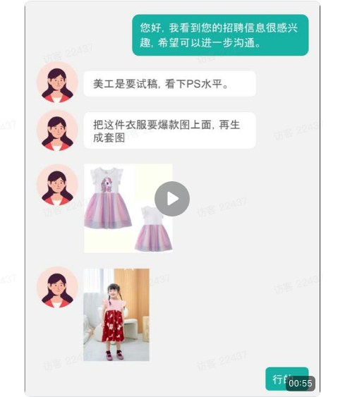
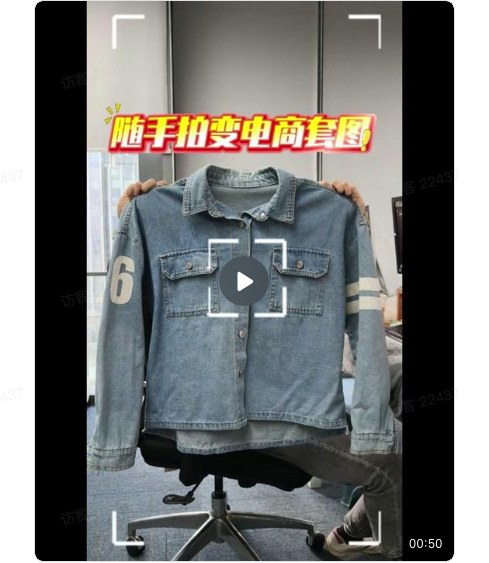
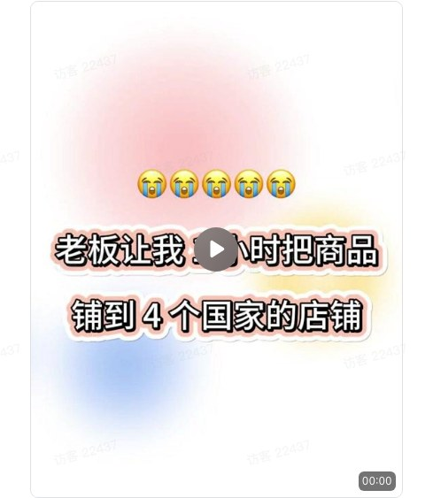
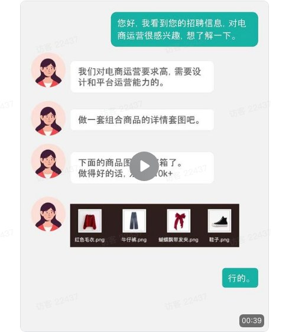
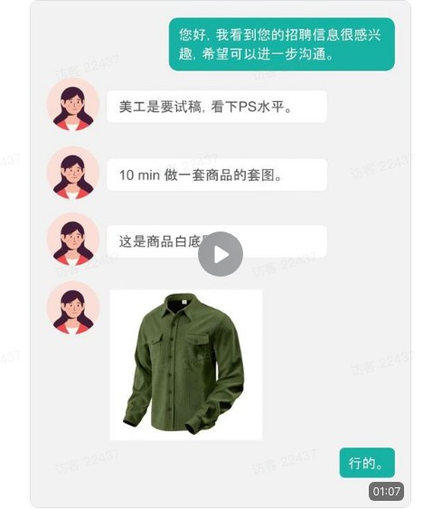
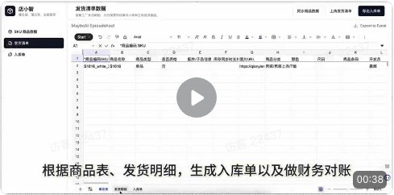

# 卖倍 AI 经典使用场景

Source: https://ecnaj5aj95hg.feishu.cn/wiki/PLsawfXpmiLEUJk6oBxc3z5WnIe
Modified: 2026-03-16T08:29:14.000Z

### 场景1：抄款换货，快速铺货

适合对象：

- 没拍摄能力的铺货卖家

- 不用拍，也能做出“像模像样”的商品页

<table>
<tr>
<td > 抄款铺货-1k 00:55</td>
<td >流程： - 找到竞品爆款图 - 一键把自己的商品“P”进去 - 一键生成多视角图 - 自动换场景、加卖点图（面料/尺码/细节） - 9图套图直接上架</td>
</tr>
</table>

### 场景2：实拍扩图，小预算做大片

适合对象：

- 有货但拍摄预算不足的中小卖家

- 一张图，变出整套专业素材

<table>
<tr>
<td > 实拍商品扩图-长-1k 00:50</td>
<td >流程： - 上传一张随手拍的商品图 - 一键生成“真人上身”主图 - 自动出 3–5 张生活场景图（咖啡厅、户外、卧室） - 补齐细节图 + 尺码对比图，打包成套</td>
</tr>
</table>

### 场景3：一图多国多平台复用

适合对象：

- 同时售卖多个国家的卖家

- 一套图，适配多个市场，省下美工成本

<table>
<tr>
<td > 多平台本地化-长-1k 00:00</td>
<td >流程： - 选定商品底图 - 一键生成多国模特上身图 + 本地化文案 - 批量输出适配各国家市场的专属商品图</td>
</tr>
</table>

### 场景4：新品测款，10 分钟出图

适合对象：

- 多电商平台测款卖家

- 测款不再靠猜，数据说了算

<table>
<tr>
<td > 配饰-商品套图 00:37</td>
<td >流程： - 上传一张饰品的商品图 - 一键生成饰品的上身穿戴图、饰品特写图、场景图 - 上架 A/B 测试，看哪组点击率高 - 选中后自动补全全套素材</td>
</tr>
</table>

### 场景5：紧急整改，秒变合规图

适合对象：

- 被 Temu/亚马逊警告的卖家

- 不用重拍，5 分钟过审

<table>
<tr>
<td > 合规检测 00:40</td>
<td >流程： - 上传有风险的图（人脸太清、有促销字、背景有阴影） - AI 自动标出问题 - 一键去人脸、去文字、去阴影 - 输出平台合规版（RGB 255,255,255 纯白底）</td>
</tr>
</table>

### 场景6：老图翻新，改色不重拍

适合对象：

- 有历史素材的品牌

- 旧图变新品，零成本焕新

<table>
<tr>
<td > 季节性换款 00:45</td>
<td >流程： - 上传去年的商品图（白色蕾丝打底衫） - 一键改成多种流行色测款（如芥末黄、灰色、咖啡色等） - 生成不同的模特穿搭图 - 批量生成新配色套图</td>
</tr>
</table>

### 场景7：套装上新，自动搭配套图

适合对象：

- 服装卖家推组合装

- 让用户一眼看懂“为什么买套装更值”

<table>
<tr>
<td > 组合SKU上新 00:39</td>
<td >流程： - 上传 4 件单品（上衣+裤子+鞋+配饰） - 一键生成“整套穿搭”主图 - 生成不同场景的展示图片 - 自动生成套装组合平铺图 - 打包成详情页</td>
</tr>
</table>

### 场景8：商品详情页自动生成

适合对象：

- 批量上新的铺货卖家

- 告别手动拼图，上新效率翻倍

<table>
<tr>
<td > 生成商品套图-1k 01:07</td>
<td >流程： - 上传商品图 + 商品参数表（尺寸/材质/重量） - AI 自动生成 9 张详情页： - 穿搭主图 + 卖点图（面料/拉链/做工）+ 细节图 - 多视角图 - 商品穿搭场景图 - 打包成套图直接上传平台使用</td>
</tr>
</table>

### 场景9：产品展示视频

适合对象：

- 新品上架，需要视频填坑位

- 信息流投放，需要大量素材测试

- 多平台分发，需要快速批量产出

### 场景10：真人场景视频

适合对象：

- 东南亚市场，你不会当地语言

- 要做本地化内容，但请当地主播成本高

- 测试新市场，不确定是否值得重投入

### 场景11：种草带货视频

适合对象：

- 从零生成：上传产品图，自动配脚本

- 参考爆款：学习爆款逻辑，用你的产品复刻

- 改编素材：已有视频快速优化、拼接

还能一键翻译多语言、替换模特商品

### 场景12：跨系统取数，完成你的对账、出入库、竞品分析

适合对象：

- 老板/财务：自动对账，多平台利润一目了然

- 运营/选品：一键分析竞品爆款与差评

- 供应链/仓储：出入库自动同步ERP，省去手工录入

<table>
<tr>
<td > 1b18038fd6804447db3d7204c1e0a8e3 00:38</td>
<td >流程： 1. 导入 ERP 中的商品 SKU 信息 2. 导入工厂出货数据 3. 系统自动核对商品信息，按 ERP 出货单模板补全字段，并生成可导入的出货单与财务对账单 4. 确认后，自动按唛头拆分表格，并支持通过 API 直接回传 ERP（无需手动导入）</td>
</tr>
</table>
