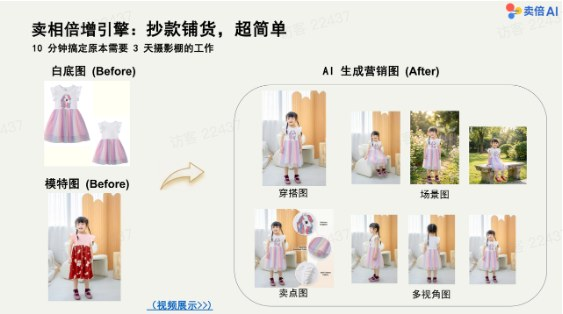
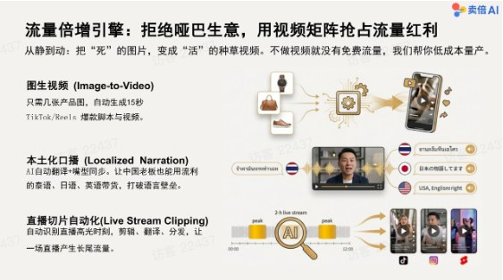
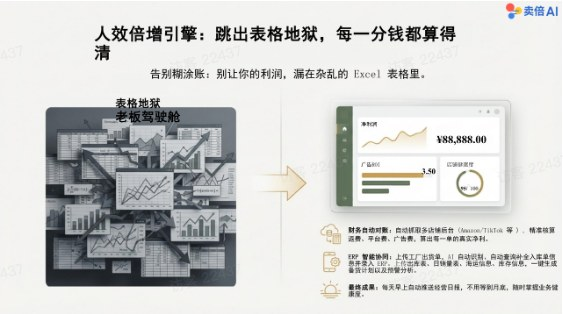
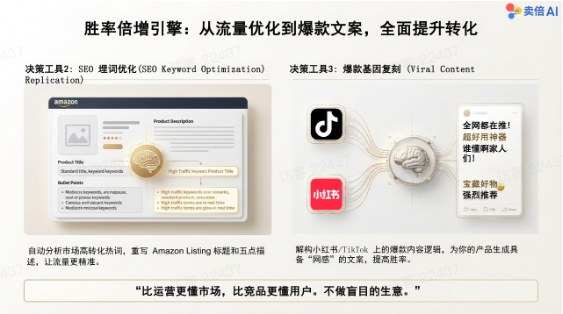

# 卖倍 AI 帮您解决哪些问题？

Source: https://ecnaj5aj95hg.feishu.cn/wiki/YkC0w1ICLit2VokXp6Zcc2A1nmx
Modified: 2026-03-16T08:28:21.000Z

### 解决商品素材点击率问题

<table>
<tr>
<td > 飞书文档 - 图片</td>
<td >- 10 分钟搞定原本需要 3 天摄影棚的工作 - 一张白底图或实拍图进，全套营销素材出（场景图、模特图、穿搭图、细节图、多视角图） - 支持虚拟穿搭、老品翻新、多国本地化文案分发 - 让抄款铺货变得超简单</td>
</tr>
</table>

### 解决解决团队获客成本问题

<table>
<tr>
<td > 飞书文档 - 图片</td>
<td >- 图生视频：几张产品图自动根据描述或者参考视频复刻各大社交平台爆款视频 - 本土化口播：AI 自动翻译+嘴型同步，抢占更多流量 - 直播切片自动化：自动识别高光时刻，剪辑、翻译、分发，让一场直播产生长尾流量</td>
</tr>
</table>

### 解决店铺对账人效问题

<table>
<tr>
<td > 飞书文档 - 图片</td>
<td >- 财务自动对账：自动抓取多店铺后台数据，精准核算每一单的真实净利 - ERP 智能协同：自动识别工厂出货单，一键生成备货计划和预警分析 - 老板驾驶舱：每天早上自动推送经营日报，随时掌握净利润、广告 ROI、店铺健康度</td>
</tr>
</table>

### 解决“选品成功率”问题

<table>
<tr>
<td > 飞书文档 - 图片</td>
<td >- AI 自动抓取分析竞品差评，生成产品改良建议书 - 爆款基因复刻：解构小红书/TikTok 等平台爆款内容逻辑，生成具备“网感”的文案 - SEO 埋词优化：自动分析市场高转化热词，重写商品详情</td>
</tr>
</table>

## 成功客户案例

<table>
<tr>
<td >类型</td>
<td >客户背景</td>
<td >痛点</td>
<td >解决方案</td>
<td >成效</td>
</tr>
<tr>
<td >供应链与内控标杆案例 😀 从“10人搬砖”到“1人轻管” 从“10人搬砖”到“1人轻管”</td>
<td >某跨境企业内部每天需要大量人力处理繁琐的非标数据</td>
<td >- 投入 10 名员工 每天进行机械劳动：核对供应商出货单、ERP 价格核对、海运费核算、生成财务对账单等 - 依赖人工复制粘贴，容易出错且效率极低，属于“表格地狱”</td>
<td >- 部署自动化数据流：将线下的动作转化为在线数据资产。 - 员工只需上传数据表，系统自动完成跨表计算、核对并生成最终的 ERP 入库单和对账</td>
<td >- 人效剧增： 人力投入从 10 人缩减为 1 人，且该员工每天仅需工作 1 小时。 - 管理升级： 团队从数据的“搬运工”变成了系统的“监控者”，彻底释放了运营和财务的人力成本。</td>
</tr>
<tr>
<td >视觉营销标杆案例 🤩 从“三天摄影棚”到“十分钟出图” 从“三天摄影棚”到“十分钟出图”</td>
<td >需要高频上新或多国分发的服装/家居类卖家</td>
<td >- 成本高昂： 拍摄一套产品图需要租棚、请模特，耗时 3 天且花费数千元 - 资源浪费： 去年卖不动的“蓝色款”库存积压，今年流行“绿色”，通常需要重新打样拍摄 - 本土化难： 同一套图无法适应欧美、日韩不同市场的审美偏好</td>
<td >- 老品翻新： AI 直接将“蓝色款”一键生成“绿色款”营销图，无需重拍。 - 虚拟穿搭与分发： 甚至无需模特（使用人台图），直接“穿”在 AI 真人模特身上；一套图自动裂变成适配 5 个国家的本地化版本（换肤色、换场景）。 - 一键测款： 使用“亚马逊测款套餐”，上传白底图自动生成“5种模特+3种场景”的 A/B 测试素材。</td>
<td >- 降本增效： 实现了 “0 摄影预算”，将 3 天的工作压缩至 10 分钟 完成。 - 复用率提升： 极大延长了旧素材和老产品的生命周期。</td>
</tr>
<tr>
<td >流量获客标杆案例 😍 打破“哑巴生意”与“语言壁垒” 打破“哑巴生意”与“语言壁垒”</td>
<td >缺乏专业视频团队，或者因语言障碍无法做多语种内容的卖家</td>
<td >- 错失流量： 只有静态图片，无法制作TikTok/Reels 短视频，拿不到平台的免费自然流量 - 语言障碍： 中国老板或主播不懂小语种（如泰语、马来西亚语），无法进行本地化口播带货，做的是“哑巴生意”</td>
<td >- 图生视频： 仅凭几张图片，AI 自动生成 15 秒的种草视频或爆款脚本。 - 多语种口播： 利用 AI 翻译 + 嘴型同步技术，让中国老板能用流利的泰语、马来西亚语进行视频带货。 - 直播切片： 自动识别直播高光时刻，剪辑并翻译分发，利用长尾流量获客。</td>
<td >- 流量收割： 把“死”的图片变成了“活”的流量收割机，无需专业编导也能量产视频。 - 市场拓宽： 零门槛触达多语种本地市场。</td>
</tr>
<tr>
<td >决策与备货标杆案例 🫡 从“拍脑袋”到“数据驱动” 从“拍脑袋”到“数据驱动”</td>
<td >经常出现库存积压或断货，选品成功率不稳定的卖家</td>
<td >- 盲目决策： 选品靠猜，不知道竞品弱点；库存管理混乱，经常“卖爆了没货”或“卖不动压货” - 利润流失： 老板月底才能算清账，利润往往漏在糊涂账里</td>
<td >- 智能备货： AI 结合人工复杂的各种数据获取与公式运算，根据最新的海运信息和销量预测，自动生成最优备货计划。 - VOC 洞察： 自动抓取竞品差评（如“拉链易坏”），生成改良建议书，直接针对对手弱点开发新品。</td>
<td >- 风险控制： 从“盲目铺货”进化为“数据驱动决策”，库存资金占用大幅降低。 - 产品竞争力： 选品胜率提高，Listing 转化率通过精准埋词得到优化。</td>
</tr>
</table>
