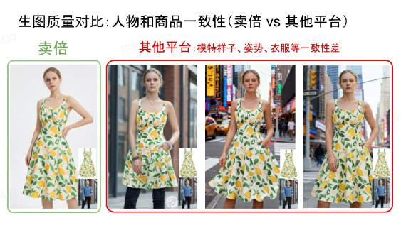
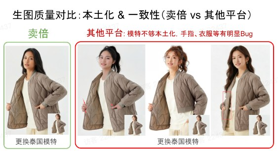
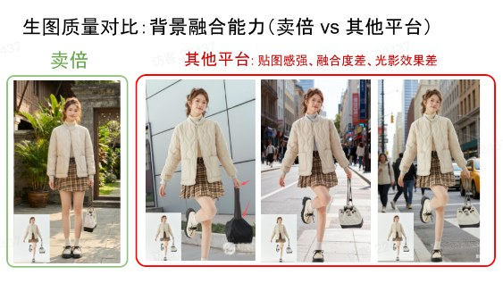
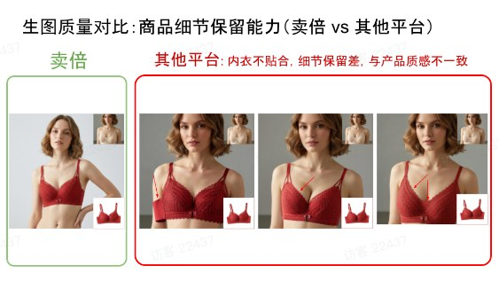
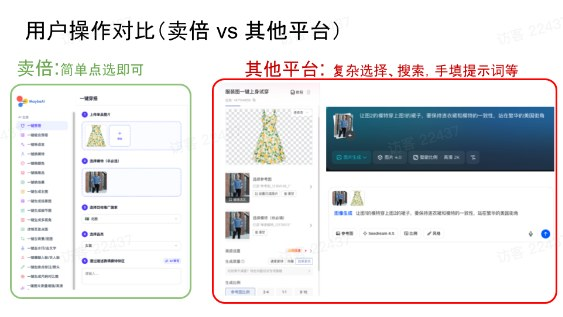

# 卖倍 AI vs 其他平台 - 效果对比

Source: https://ecnaj5aj95hg.feishu.cn/wiki/JEP8wm9X7iUd9Jka3docQoatnjc
Modified: 2026-03-16T08:29:52.000Z

> 我们深知，一张好图决定点击率，一次顺畅的操作决定人效。
>
> 卖倍 AI 不止是“能用”，更要“好用”、“耐用”、“能出爆款”。

### 人物与商品一致性 —— 卖倍 AI 做到“严丝合缝”

a. 结果：你的商品看起来更真实、更高级，买家信任度更高。

<table>
<tr>
<td > 飞书文档 - 图片</td>
<td >- 卖倍 AI：模特姿势、衣服褶皱、图案走向，完全贴合原图，无变形、无错位。 - 其他平台：常出现模特脸型/身材突兀、衣服穿歪、图案断裂等问题，影响专业感和转化。</td>
</tr>
</table>

### 本土化能力 —— 卖倍 AI 让“换模特”不再踩坑

a. 结果：真正实现“一图多国”，高效节省人力

<table>
<tr>
<td > 飞书文档 - 图片</td>
<td >- 卖倍 AI：更换泰国模特后，肤色、发型、妆容、甚至手势都自然融入，无违和感。 - 其他平台：模特替换后常出现“手指穿模”、“衣服拉链消失”、“比例失调”等明显Bug。</td>
</tr>
</table>

### 背景融合能力 —— 卖倍 AI 告别“贴图感”

a. 结果：提升图片质感，让买家感觉“身临其境”，点击率自然提升

<table>
<tr>
<td > 飞书文档 - 图片</td>
<td >- 卖倍 AI：光影、透视、阴影与背景完美融合，商品像“长”在场景里。 - 其他平台：边缘生硬、光影不匹配、物品悬浮，一看就是AI合成。</td>
</tr>
</table>

### 商品细节保留能力 —— 卖倍 AI 把“质感”做到极致

a. 结果：减少售后纠纷，提升客户满意度和复购率

<table>
<tr>
<td > 飞书文档 - 图片</td>
<td >- 卖倍 AI：内衣蕾丝、纽扣、拉链、面料纹理等细节清晰保留，还原产品真实质感。 - 其他平台：常出现“内衣不贴身”、“细节模糊”、“材质失真”等问题，与实物不符。</td>
</tr>
</table>

### 用户操作体验 —— 卖倍 AI 让“小白也能上手”

a. 门槛低，好上手，节省时间

<table>
<tr>
<td > 飞书文档 - 图片</td>
<td >- 卖倍 AI：功能模块清晰，一键点选即可生成，无需写提示词、无需复杂设置。 - 其他平台：需要手动输入大量参数、搜索关键词、调整比例，学习成本高，易出错。</td>
</tr>
</table>
