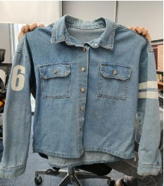
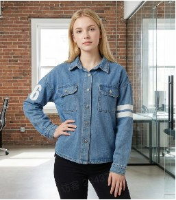
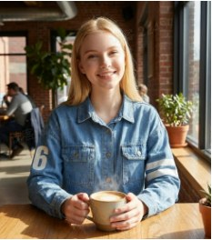
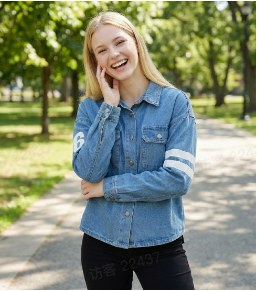
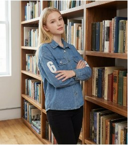
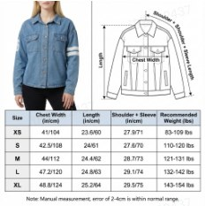
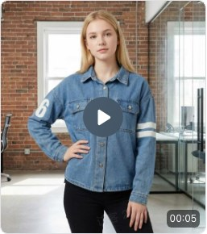

# 各类电商卖家 - 实操最佳实践

Source: https://ecnaj5aj95hg.feishu.cn/wiki/GJW1wXU4FiuV42kKYZWcHP8Xnur
Modified: 2026-04-14T11:28:23.000Z

## 跨境深度本土化卖家

- 适合卖家： 跨国经营（如亚马逊、独立站），核心需求是消除“中国制造”痕迹，建立本地品牌信任。

- Listing & 视频链路：
  a. 底图重置 ：【白底/透明图】/【图片高清化】将实拍原图抠图并修复为高质感母图。
  b. 模特本土化 ：【商品模特图】将东亚面孔替换为目标国（白人/黑人/拉美等）模特。
<table>
<tr>
<td >随手拍的照片</td>
<td >本土模特穿搭图</td>
</tr>
<tr>
<td > 飞书文档 - 图片</td>
<td > 飞书文档 - 图片</td>
</tr>
</table>
  c. 场景本土化 ：【给商品换场景】将自己的商品换到目标参考场景图上，或是使用【场景图】将背景换为目标国典型的家居、街道或自然环境等。
    i. 【参考生单图】如参考场景图的排版较为复杂（如有多个角度/多个SKU/多个颜色商品），可以使用它将自己的商品替换上去（注意：要上传自己商品多个角度/多个SKU/多个颜色的图片）
    1. 【场景裂变】将商品场景图的背景稍作更改，避免下架或是抄袭等风险。
<table>
<tr>
<td >场景1:咖啡厅</td>
<td >场景2:户外</td>
<td >场景3:室内</td>
</tr>
<tr>
<td > 飞书文档 - 图片</td>
<td > 飞书文档 - 图片</td>
<td > 飞书文档 - 图片</td>
</tr>
</table>
  d. 地道翻译：【图片翻译】将中文或是其他国家的语言的设计/排版图换成目标国家的语言；【文字编辑】翻译后手动微调，确保单位、用词符合当地俗语。
<table>
<tr>
<td >英文+欧美模特</td>
<td >泰文+泰国模特</td>
</tr>
<tr>
<td > 飞书文档 - 图片</td>
<td > 飞书文档 - 图片</td>
</tr>
</table>
  e. 动态展示：【单图转视频】让本土化后的主图动起来，生成原生感强的视频素材，或使用【首尾帧生视频】。
    i. 【多图转视频】：适用于多场景多角度展示介绍商品。
<table>
<tr>
<td >模特穿搭动态展示</td>
</tr>
<tr>
<td > generated-video-1 (53) 00:00</td>
</tr>
</table>

## 无货源/精铺跨境卖家

- 适合卖家： 核心是“快”和“去侵权”，直接搬运图片。

- Listing 链路：
  a. 洗图去水印 ：【去水印】抹除原图 Logo，再用【图片高清化】提升画质。
  b. 本土化翻译：【图片翻译】一键将中文详情翻译成当地语言。
  c. 模特换头：【商品模特图】将原图中的亚洲模特替换成当地肤色模特。
  d. 背景重塑 ：【给商品换场景】让采集来的图看起来像是在当地拍摄。
  e. 合规处理 ：【模糊人脸/去人脸】彻底规避肖像侵权风险。

## 视频内容电商：生成多个视频素材再合成或混剪

- 适合卖家： 需要快速低成本产出视频素材的卖家（for 混剪），自己没有专业拍摄团队或拍摄预算有限

- 实操步骤：
  - 生成商品白底图(如有则跳过)：【白底/透明图】 把实拍图/商品主图等图片，生成白底图，方便后续步骤
  - 生成视觉分镜图： 【单件穿搭】生成高颜值主图与模特穿搭图，或是【商品替换】/【场景图】生成商品场景图。
  - 生成细节分镜图 ： 【细节图】+【角度图】生成多维度的产品特写，作为视频剪辑空镜。
  - 单图视频 (定格动画)： 【单图转视频】单个分镜图变成动态视频素材。上传分镜图，输入视频要求即可生成
    - 温馨提示：如果不知道怎么写视频要求，可以借助豆包、deepseek之类的AI，把分镜图放进去，然后告诉它是什么商品，以及你的想法，让它给你生成AI视频提示词就好。
  - 多图串联视频 (商详视频)： 【多图转视频】上传上述多个分镜图，输入视频要求，即可生成多个分镜素材合成的长视频
    - 温馨提示：如果不知道怎么写视频要求，可以借助豆包、deepseek之类的AI，把分镜图放进去，然后告诉它是什么商品，以及你的想法，让它给你生成AI视频提示词就好。

## 视频内容电商：爆款视频复刻

- 适合卖家：追踪热点流量、需要海量产出引流视频的内容电商卖家，但自己没有专业拍摄团队或拍摄预算有限

- 实操步骤：
  - 方案1: 一键翻拍视频
    - 【视频翻拍】上传原视频 + 自己的产品图，AI 自动分析其脚本节奏、运镜方式并提取提示词，AI 保持原片节奏和爆款结构，将主角替换成你的商品。
      - 翻拍不能保证100%还原所有镜头，如有部分节奏不协调或是穿帮镜头，可以稍作剪辑；另外可以叠加静态分镜图转视频的素材，做混合剪辑。
  - 方案2：逐个分镜拆解和替换
    - Step 1: 【视频分析】自动拆解参考视频的脚本和分镜图，下载各个分镜图
    - Step 2: 【商品替换】逐一生成对应商品的分镜图，上传商品图，再上传参考视频的分镜图，点击生成即可
    - Step 3: 生成分镜图的分镜视频
      - 逐个生成分镜视频： 【单图转视频】上传分镜图，输入视频要求（复制 Step 1 得到的分镜脚本）即可生成
      - 批量生成分镜视频：【多图转视频】上传 Step 2 的多个分镜图，输入视频要求（复制 Step 1 得到的分镜脚本）即可生成多个分镜素材合成的长视频
    - Step 4: 剪辑合成多个分镜视频素材
      - 根据需要对多个视频素材或长视频做后期剪辑和合成即可

## 预算有限的实拍扩图卖家

- 适合卖家： 有货源、懂产品，但不想花几千块请摄影团队的中小卖家，有手机拍摄的底图、白底图或平铺图。

- 实操步骤：
  - 画质重塑：【白底/透明图】将手机拍摄的图片一键精修成白底/透明图的平铺图。
    - 如是服装，【服装3D图】可以一键转成更有质感和实用的3D图。
  - 一键穿搭主图：【单件穿搭】将平铺衣服或人台图等直接转化为高颜值真人模特实穿主图。
  - 生活化场景化：【给商品换场景】/【场景图】将白底图换成卧室、咖啡厅、办公室等真实使用场景。
  - 自动生成细节图：【细节图】利用 AI 对产品局部进行重绘或放大，生成拉链、面料、Logo 特写。
  - 规格说明：【尺码对比图】+【详情页卖点图】快速生成标准化的尺码表与功能拆解图。

## 组合套装/关联销售的卖家

- 适合卖家： 做服饰穿搭方案、家居套装、数码配件组合等的卖家，需要把多个单品素材，需要组合成套装（如：上衣+裤子、耳机+充电宝）展示。

- 实操步骤：
  - 多件融合穿搭：【多件融合模特穿搭】如上传上衣和下装的底图，AI 自动合成模特成套穿着的效果。
  - 组合套装场景化：【给商品换场景】/【场景图】将上一步骤的组合穿搭模特图换成卧室、咖啡厅、办公室等真实场景中。
  - 参考场景搭配套装：【参考生单图】将多个单品（如餐桌+餐椅+餐具）组合到目标参考的场景背景中，如套装平铺图、套装场景图等。

## 快速抄款铺货的卖家

- 适合卖家： 精铺/通铺卖家、追风口抄款卖家、无自拍能力的卖家，已经有淘宝/1688/竞品店铺等的爆款图（非自有原图）。

- 实操步骤：
  - 去重避危：【去水印】+【白底/透明图】抹除原店 Logo，提取商品主体，切断原图溯源。
  - 场景参考裂变：【场景裂变】将商品场景图的背景稍作更改，避免下架或是抄袭等风险。
  - 一键换场景：【给商品换场景】/【场景图】将竞品的拍摄背景换成完全不同的环境，实现视觉上的“去重”。
  - 本土化改版：【图片翻译】+【换模特】将中文图翻译并换成目标国籍模特面孔。
