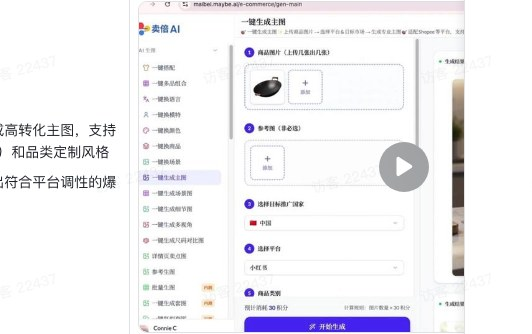
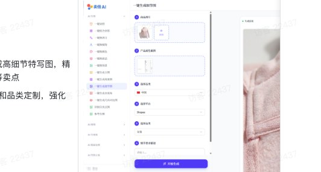
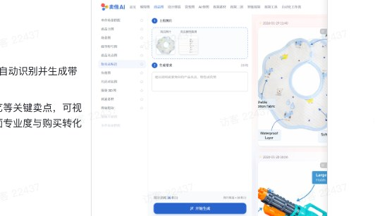
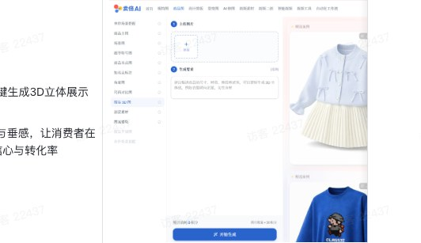
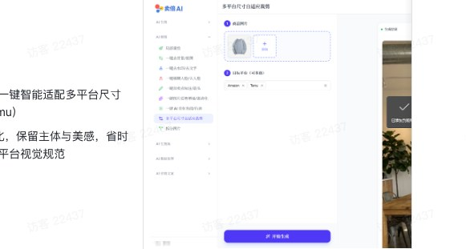
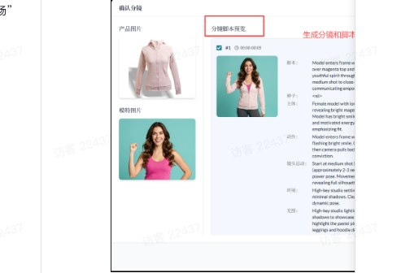
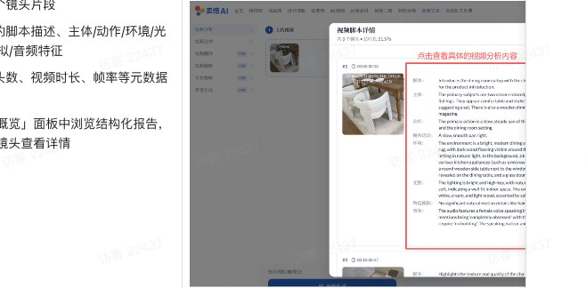

# 卖倍 AI 功能操作指南

Source: https://ecnaj5aj95hg.feishu.cn/wiki/OiuQwIWJ9iXoSGkkN6rcR1MGnWf
Modified: 2026-04-08T04:03:16.000Z

## 📍卖倍 AI 功能介绍

## AI 生图

#### 模特图

<table>
<tr>
<td >功能</td>
<td >说明</td>
<td >操作流程</td>
</tr>
<tr>
<td >单件模特穿搭 （原名：一键搭配）</td>
<td >1. 只需上传一张单品平铺图，即可一键生成多姿势、不同国家、不同肤色的模特上身效果图 2. 支持女装、鞋袜、箱包、美妆个护等，轻松打造全球化推广所需的多样化视觉素材</td>
<td > 一键搭配操作 00:14</td>
</tr>
<tr>
<td >多件融合模特穿搭 （原名：一键多品组合）</td>
<td >1. 上传多件商品图，一键智能组合搭配，自动生成真实场景中的模特上身效果图 2. 支持按国家风格定制，快速打造高转化视觉素材</td>
<td > 一键多品组合 00:17</td>
</tr>
<tr>
<td >换模特 （原名：一键换模特）</td>
<td >1. 上传现有模特图或者模特库选择模特，一键智能更换为理想人设或本地化形象 2. 支持按国家/风格定制，保留服装细节与场景氛围，快速生成高转化率的差异化视觉素材</td>
<td > 飞书文档 - 图片</td>
</tr>
</table>

#### 商品图

<table>
<tr>
<td >功能</td>
<td >说明</td>
<td >操作流程</td>
</tr>
<tr>
<td >商品替换 （原名：一键换商品/场景）</td>
<td >1. 上传新款商品图 + 旧款场景图，一键智能替换商品 2. 保留原场景氛围与模特姿态，快速生成真实感强的新品实拍图，省时省力又省钱</td>
<td > 一键换商品操作 00:00</td>
</tr>
<tr>
<td >商品主图 （原名：一键生成主图）</td>
<td >1. 上传商品图，一键智能生成高转化主图，支持按国家、平台（如Shopee）和品类定制风格 2. 可参考样图优化，快速产出符合平台调性的爆款首图</td>
<td > 一键生成主图操作 00:00</td>
</tr>
<tr>
<td >场景图 （原名：一键生成场景图）</td>
<td >1. 上传商品图，一键智能生成高质感场景图 2. 支持按国家（如泰国）、平台（如Shopee）和品类定制风格，自动匹配真实生活场景，提升转化与沉浸感</td>
<td > 一键生成场景图操作 00:00</td>
</tr>
<tr>
<td >细节特写图 （原名：一键生成细节图）</td>
<td >1. 上传商品图，一键智能生成高细节特写图，精准突出面料、走线、工艺等卖点 2. 支持按平台（如Shopee）和品类定制，强化用户信任感与购买欲</td>
<td > 飞书文档 - 图片</td>
</tr>
<tr>
<td >商品卖点图 （原名：详情页卖点图）</td>
<td >1. 上传商品图+属性截图，一键智能生成详情页卖点图 2. 自动标注面料、拉链等核心细节，视觉化突出产品优势，提升转化率与专业感</td>
<td > 飞书文档 - 图片</td>
</tr>
<tr>
<td >加卖点标注</td>
<td >1. 上传商品图+属性截图，AI自动识别并生成带标注的卖点展示图 2. 智能标注面料、版型、工艺等关键卖点，可视化呈现产品特色，增强页面专业度与购买转化</td>
<td > 飞书文档 - 图片</td>
</tr>
<tr>
<td >角度图 （原名：一键生成多视角）</td>
<td >1. 上传单品图，一键智能生成多角度模特上身图（正面/侧面/背面） 2. 完整展示商品全貌，提升用户信任与转化效率</td>
<td > 飞书文档 - 图片</td>
</tr>
<tr>
<td >尺码对比图 （原名：一键生成尺码对比图）</td>
<td >1. 上传商品图+尺码表，一键智能生成专业尺码对比图 2. 自动匹配模特展示与数据标注，降低退货率，提升买家决策效率，适配全球多平台规范</td>
<td > 飞书文档 - 图片</td>
</tr>
<tr>
<td >服装3D图</td>
<td >1. 上传1张服装平铺图，AI一键生成3D立体展示图 2. 360°全方位展示服装版型与垂感，让消费者在线也能&quot;试穿&quot;，提升购买信心与转化率</td>
<td > 飞书文档 - 图片</td>
</tr>
<tr>
<td >创意素材</td>
<td >1. 文字描述或参考图即可生成创意图案，无需设计基础也能做出爆款元素 2. 快速迭代多种图案方案，丰富产品线，测试市场反应，提升爆款概率</td>
<td > 飞书文档 - 图片</td>
</tr>
<tr>
<td >图案提取</td>
<td >1. 上传衣服即可智能提取图案/印花，无需手动抠图，秒级出图 2. 精准识别图案边界，支持复杂背景分离，快速获取设计素材，降低美工工作量</td>
<td > 飞书文档 - 图片</td>
</tr>
</table>

#### 设计排版

<table>
<tr>
<td >功能</td>
<td >说明</td>
<td >操作流程</td>
</tr>
<tr>
<td >参考生单图 （原名：参考生图）</td>
<td >1. 上传多张商品图+参考图，一键智能修图以及排版设计 2. 支持指定颜色、模特、场景等细节，精准还原设计意图，快速产出高转化视觉素材；如有指定的模特图，上传的商品图、场景/排版图中尽量不要出现其他模特的脸部；建议通过一键换模特，先把场景/排版图中的模特换成指定的模特</td>
<td > 参考生图操作 00:13</td>
</tr>
<tr>
<td >参考生套图</td>
<td >1. 输入产品信息+参考模版+生成要求，AI批量生成多套商品展示图 2. 一键产出多风格套图，满足多场景展示需求，大幅提升上新效率与页面丰富度</td>
<td > 飞书文档 - 图片</td>
</tr>
<tr>
<td >Listing套图/详情页套图 （原名：一键生成套图）</td>
<td >1. 上传商品单张或多角度图片，输入产品基础信息与核心卖点，选择目标平台及套图类型 2. 卖倍 AI 将基于内置的专业电商提示词库，自动生成一套高转化率、风格统一、平台适配的商品视觉素材。</td>
<td > 一键生套图操作 00:22</td>
</tr>
<tr>
<td >参考风格生图</td>
<td >1. 上传产品图+参考套图（最多10张），AI批量替换参考图中的产品，保持风格一致 2. 支持自定义调整要求，一键生成多场景展示图，快速搭建统一视觉风格的商品图库</td>
<td > 飞书文档 - 图片</td>
</tr>
<tr>
<td >新增品牌模板</td>
<td >1. 一键导入品牌模板图片作为参考图，快速复用品牌视觉风格，保持调性统一 2. 无缝衔接&quot;参考风格生图&quot;功能，批量生成符合品牌规范的套图，提升出品效率与专业度</td>
<td > 飞书文档 - 图片</td>
</tr>
</table>

#### 裂变图

<table>
<tr>
<td >功能</td>
<td >说明</td>
<td >操作流程</td>
</tr>
<tr>
<td >场景裂变</td>
<td >1. 上传1张主图，智能裂变多种背景场景，无需额外拍摄，秒级出图 2. 支持自定义场景风格，快速覆盖多人群、多渠道展示需求，降低拍摄成本，提升上新效率</td>
<td > 飞书文档 - 图片</td>
</tr>
<tr>
<td >图案裂变</td>
<td >1. 上传衣服图案或印花，AI智能裂变生成多种变体设计，一键拓展图案素材库 2. 自动衍生同风格多版本图案，支持色彩、元素、布局等维度变化，丰富产品设计线，提升上新效率</td>
<td > 飞书文档 - 图片</td>
</tr>
<tr>
<td >款式裂变</td>
<td >1. 上传原图+描述需求，智能裂变不同款式变体，从细节到版型灵活调整 2. 支持袖长、领型、下摆等多维度修改，快速产出系列化款式，丰富产品线，降低开发成本</td>
<td > 飞书文档 - 图片</td>
</tr>
<tr>
<td >换颜色 （原名：一键换颜色）</td>
<td >1. 上传单品图，一键智能换色，支持参考色卡或自由描述 2. 精准还原材质质感与光影效果，快速生成多色系商品图，提升SKU展示效率</td>
<td > 一键换颜色操作 00:14</td>
</tr>
<tr>
<td >换动作</td>
<td >1. 根据参考图片的动作姿势，一键裂变更换模特姿势</td>
<td > 飞书文档 - 图片</td>
</tr>
<tr>
<td >换场景</td>
<td >1. 根据参考图片的场景，生成类似的新场景</td>
<td > 飞书文档 - 图片</td>
</tr>
</table>

## AI 修图

<table>
<tr>
<td >功能</td>
<td >说明</td>
<td >操作流程</td>
</tr>
<tr>
<td >图片翻译 （原名：一键换语言）</td>
<td >1. 上传带文案的营销图，一键智能翻译并适配目标国家语言风格 2. 自动生成本地化广告素材，助你高效出海、精准触达海外用户</td>
<td > 一键换语言操作 00:08</td>
</tr>
<tr>
<td >文字编辑</td>
<td >1. 上传商品图，精准定位并修改图片局部文案，无需重新设计整图 2. 支持多语言、多字体智能替换，快速适配不同渠道与活动需求，大幅降低修图成本</td>
<td > 飞书文档 - 图片</td>
</tr>
<tr>
<td >局部重绘</td>
<td >1. 上传图片，圈选区域+文字描述，一键智能局部重绘，精准替换颜色、元素或细节（如“把衣服换成蓝色”） 2. 保留原图氛围与质感，高效实现精细化修图</td>
<td > 飞书文档 - 图片</td>
</tr>
<tr>
<td >透明图 （原名：一键去背景/抠图）</td>
<td >1. 上传图片，一键智能去背景/精准抠图，自动分离主体与背景 2. 支持复杂毛发、透明材质等精细处理，快速获得干净白底图或者透明背景图，适配电商、广告多场景使用</td>
<td > 飞书文档 - 图片</td>
</tr>
<tr>
<td >去水印 （原名：一键去水印/去文字）</td>
<td >1. 上传图片，一键智能去除水印或文字 2. 保留画面完整性与自然质感，轻松清理干扰元素，让素材更干净专业</td>
<td > 飞书文档 - 图片</td>
</tr>
<tr>
<td >一键模糊人脸/去人脸</td>
<td >1. 上传模特图，一键智能模糊或移除人脸，保护隐私同时保留身材与服装细节 2. 适用于敏感品类展示或合规化推广，安全高效不伤质感</td>
<td > 飞书文档 - 图片</td>
</tr>
<tr>
<td >加卖点标注 （原名：一键加卖点标注/箭头）</td>
<td >1. 上传商品图+属性截图，一键智能添加卖点标注与箭头指引 2. 自动突出材质、设计、功能等核心优势，视觉化引导用户关注，提升转化率与专业度</td>
<td > 飞书文档 - 图片</td>
</tr>
<tr>
<td >图片高清化 （原名：一键图片质量增强/高清化）</td>
<td >1. 上传模糊或低清图，一键智能增强画质+高清化 2. 自动锐化细节、还原纹理与光影，让商品图秒变专业级质感，提升视觉吸引力与买家信任感</td>
<td > 飞书文档 - 图片</td>
</tr>
<tr>
<td >调光线 （原名：一键AI 美化光线/色调）</td>
<td >1. 上传图片，一键AI智能优化光线与色调，自动提升氛围感、肤色质感与背景层次 2. 轻松打造高级感视觉效果，让每张图都像专业摄影出品</td>
<td > 飞书文档 - 图片</td>
</tr>
<tr>
<td >多平台尺寸自适应裁剪</td>
<td >1. 上传一张商品图，一键智能适配多平台尺寸（如Amazon、Temu） 2. 自动裁剪+构图优化，保留主体与美感，省时省力，高效满足各平台视觉规范</td>
<td > 飞书文档 - 图片</td>
</tr>
<tr>
<td >拆分图片</td>
<td >1. 上传拼图或组合图，一键智能拆分多个独立画面 2. 精准识别并分离各部分内容，快速获取单张素材，提升图片复用与管理效率</td>
<td > 飞书文档 - 图片</td>
</tr>
<tr>
<td >图片拼接</td>
<td >1. 上传多张图片，一键智能拼接成组合展示图，支持横排/竖排/网格多种布局 2. 快速整合主图、细节图、场景图，打造完整商品展示页，提升页面信息密度与专业感</td>
<td > 飞书文档 - 图片</td>
</tr>
<tr>
<td >自定义生图</td>
<td >1. 文字即画面：描述理想效果，AI一键生成高质量商品图，实现“所想即所得” 2. 满足个性化营销需求，快速产出差异化视觉素材，打造独一无二的品牌调性</td>
<td > 飞书文档 - 图片</td>
</tr>
<tr>
<td >分析图片</td>
<td >1. 输入竞品或标杆图，自动识别构图比例、色彩搭配及字体层级，秒级生成风格画像 2. 告别凭感觉模仿，用数据量化优秀案例的视觉密码，快速复刻高转化详情页结构</td>
<td > 飞书文档 - 图片</td>
</tr>
</table>

## AI 生视频

#### 视频素材

<table>
<tr>
<td >功能</td>
<td >说明</td>
<td >操作流程</td>
</tr>
<tr>
<td >单图转视频</td>
<td >1. 上传产品图 + 简单描述你想要的视频效果，一键生成动态展示视频 a. 如包包左右晃动、由远推近，模特穿衣走动展示等等 2. 无需实拍，5~10秒内让静态图“活”起来，提升视觉吸引力与转化率</td>
<td > 图生视频操作 00:16</td>
</tr>
<tr>
<td >多图转视频</td>
<td >1. 多图转视频功能支持上传多组产品图片 2. 您可为每张图片添加画面动作描述（如“开心走向镜头”）或台词文本，卖倍 AI将自动把每张图片转化为5秒视频片段 3. 通过增减图片数量灵活控制视频总时长</td>
<td > 飞书文档 - 图片</td>
</tr>
<tr>
<td >首尾帧生视频</td>
<td >1. 首尾帧视频功能支持上传视频首帧与尾帧图片 2. 通过描述期望的过渡效果、动作或氛围，自定义视频时长与配音，一键生成首尾自然衔接的创意过渡视频</td>
<td > 飞书文档 - 图片</td>
</tr>
<tr>
<td >创意产品视频 （内测中）</td>
<td >创意产品视频是面向内容创作者的「自由发挥型」AI视频生成工具——您只需上传一张产品图片，再用自然语言描述您的创意构想，系统即可理解，智能生成风格统一、画面专业的动态产品展示视频。 操作流程步骤 1. 上传产品图片 a. 上传清晰的产品主图 2. 输入创意要求 在文本框中自由描述您期望的视频表现，例如： - 镜头运动（推拉摇移、环绕、俯拍等） - 场景氛围（极简白棚 / 复古咖啡馆 / 户外阳光下） - 动作与交互（产品自动旋转 / 手部轻触触发特效 / 液体倾倒慢动作） 3. 设置视频市场 4. 一键生成视频</td>
<td > 飞书文档 - 图片</td>
</tr>
</table>

##### 🚫 提示词技巧 & 使用注意事项 & 能力边界

<table>
<tr>
<td >提示词技巧</td>
<td >1. 描述使用简单句式，避免复杂描述 a. 比如&quot;蒙娜丽莎用手戴上墨镜&quot; 而非 &quot;让画中的蒙娜丽莎戴上墨镜&quot; - 简单句式 2. 动作描述符合自然物理规律 - 比如&quot;树叶随风飘动&quot; 而非 &quot;树叶逆重力上升&quot; - 符合物理规律</td>
</tr>
<tr>
<td >注意事项</td>
<td >1. 不允许上传暴力、色情、政治敏感类等违规图片 2. 图片分辨率最低≥300×300px，图片质量越高越好 3. 首尾帧功能： a. 上传2张相似图片分别作为首尾帧，实现动态过渡 b. 尽量选择主题相近、构图相似的图片，避免大幅差异触发镜头切换</td>
</tr>
<tr>
<td >能力边界（当前限制）</td>
<td >1. 复杂物理仿真： a. 比如水流动、布料飘动细节、多物体碰撞、极速运动动作等 2. 精确时间指令遵循： a. 比如“先微笑3秒”再“皱眉2秒”等 3. 多机位视角同步生成 4. 文字和手部细节崩坏 a. 原图中包含大量清晰的文字文本，或者需要非常精细的手部交互动作（如弹钢琴、穿针引线），生成视频后大概率会模糊、扭曲或出现多指。</td>
</tr>
</table>

#### 视频二创

<table>
<tr>
<td >功能</td>
<td >说明</td>
<td >操作流程</td>
</tr>
<tr>
<td >视频翻拍</td>
<td >视频翻拍功能通过AI智能分析与自动化替换，帮助用户高效复刻优质竞品视频创意。 操作流程步骤 1. 上传商品图片 上传需植入的目标商品图片，作为视频核心展示素材。 2. 导入参考视频 选择竞品参考视频，AI自动分析并拆解为多分分镜，生成分镜脚本、主体动作、环境细节等完整解析。 3. 选择分镜脚本 浏览各分镜的详细分析内容，挑选符合需求的分镜进行商品替换（可多选）。 4. 分镜生图替换 针对选定分镜，AI智能将商品图植入对应场景，生成替换后的分镜图片。 5. 确认生图效果 检查替换后的图片细节（如商品展示角度、场景融合度），确保效果符合预期。 6. 合成最终视频 确认所有分镜后，一键合成连贯的个性化视频，完成翻拍流程。</td>
<td > 视频分析与翻拍操作 02:03</td>
</tr>
<tr>
<td >视频元素替换 （内测中）</td>
<td >1. 支持上传原始视频与产品图片，通过设置替换目标即可快速生成风格一致的创意视频； 2. 无需专业剪辑技能，轻松实现产品植入与视频复刻，高效打造个性化带货内容，助力营销转化。 注意事项： 1. 上传的视频要出现人物身体 2. 不适用于多镜头视频 3. 适用于单一镜头展示商品的视频，进行元素替换</td>
<td > 飞书文档 - 图片</td>
</tr>
</table>

##### 🚫 提示词技巧 & 使用注意事项 & 能力边界

<table>
<tr>
<td >提示词技巧</td>
<td >1. 描述使用简单句式，避免复杂描述 a. 比如&quot;蒙娜丽莎用手戴上墨镜&quot; 而非 &quot;让画中的蒙娜丽莎戴上墨镜&quot; - 简单句式 2. 动作描述符合自然物理规律 - 比如&quot;树叶随风飘动&quot; 而非 &quot;树叶逆重力上升&quot; - 符合物理规律</td>
</tr>
<tr>
<td >注意事项</td>
<td >1. 不允许上传暴力、色情、政治敏感类等违规图片 2. 人脸上传禁令 a. 无法从含有真人人脸的图片生成视频，底层大模型会自动检测并拦截任务 3. 肖像权保护 a. 禁止使用未经许可的名人、公众人物等人物形象 4. 版权素材 a. 不得上传非自有或者未经授权的图片/视频</td>
</tr>
<tr>
<td >能力边界（当前限制）</td>
<td >1. 复杂物理仿真： a. 比如水流动、布料飘动细节、多物体碰撞、极速运动动作等 2. 精确时间指令遵循： a. 比如“先微笑3秒”再“皱眉2秒”等 3. 多角色精准互动 a. 多人对话时的口型、表情、手势同步 4. 文字/logo精准生成 a. 视频中出现的文字不可控</td>
</tr>
</table>

#### 智能视频

<table>
<tr>
<td >功能</td>
<td >说明</td>
<td >操作流程</td>
</tr>
<tr>
<td >一键生视频</td>
<td >一键生视频功能通过AI智能整合产品多维度素材（多角度图片、场景图、商品信息），结合预设视频类型模板（如抖音种草视频、采访视频等）与个性化生成指令，实现“输入即产出”的高效视频制作。 操作流程步骤 1. 上传产品素材 上传产品多角度图片、场景图及商品信息，确保覆盖核心展示维度（如产品正面、侧面、使用场景等）。 2. 选择视频类型 从下拉菜单中选定目标视频类型（如抖音种草视频、采访视频、教程视频等），匹配业务场景与平台特性。 3. 填写生成要求 输入具体需求描述，明确产品卖点、风格调性及细节要求。 4. 一键生成视频 点击生成按钮，系统自动整合素材、匹配模板、优化细节，快速输出符合要求的创意视频，完成从素材到成品的高效转化。</td>
<td > 飞书文档 - 图片</td>
</tr>
<tr>
<td >AI导演分镜视频</td>
<td >操作流程步骤 1. 上传商品图片 上传清晰产品图 2. 选择模特与视频类型 - 模特：从库中挑选适配人设的模特，或者自行上传模特 - 视频类型：选择目标场景模板（如“抖音种草”“小红书氛围感”“淘宝详情页开场”等） 3. 查看并调整AI生成分镜 系统自动生成分镜方案 4. 确认分镜并合成视频</td>
<td > 飞书文档 - 图片  飞书文档 - 图片</td>
</tr>
</table>

#### 视频工具

<table>
<tr>
<td >功能</td>
<td >说明</td>
<td >操作流程</td>
</tr>
<tr>
<td >视频分析</td>
<td >视频分析功能帮助用户快速解构热门或竞品视频的创作逻辑——只需上传一段视频，AI即可自动识别并结构化输出其核心内容要素 操作流程步骤 1. 上传视频 2. AI智能解析 - 拆解为多个镜头片段 - 提取每镜的脚本描述、主体/动作/环境/光效/物理模拟/音频特征 - 输出总镜头数、视频时长、帧率等元数据 3. 查看分析结果 在「视频脚本概览」面板中浏览结构化报告，支持展开单个镜头查看详情</td>
<td > 飞书文档 - 图片  飞书文档 - 图片</td>
</tr>
<tr>
<td >视频合并</td>
<td >快速合并多个视频片段 操作流程步骤 1. 上传多个视频片段 2. 一键合成</td>
<td > 飞书文档 - 图片</td>
</tr>
</table>
