# 卖倍 AI 案例合集（生图）

Source: https://ecnaj5aj95hg.feishu.cn/wiki/Irftw8ueciaQYpkODE6cD4p5ngh
Modified: 2026-04-21T07:48:26.000Z

## 一、卖倍 AI 功能案例

## AI 生图

<table>
<tr>
<td >卖倍 AI 功能</td>
<td >用户输入</td>
<td >卖倍 AI 输出</td>
</tr>
<tr>
<td >单件模特穿搭</td>
<td >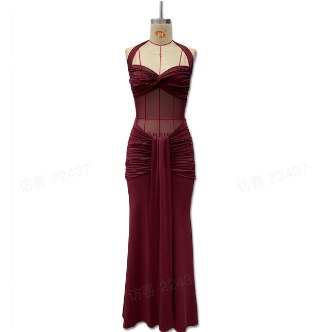 飞书文档 - 图片</td>
<td >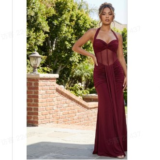 飞书文档 - 图片</td>
</tr>
<tr>
<td >多件融合模特穿搭</td>
<td >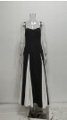 飞书文档 - 图片 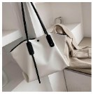 飞书文档 - 图片 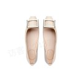 飞书文档 - 图片</td>
<td >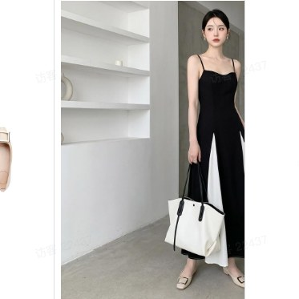 飞书文档 - 图片</td>
</tr>
<tr>
<td >换模特</td>
<td >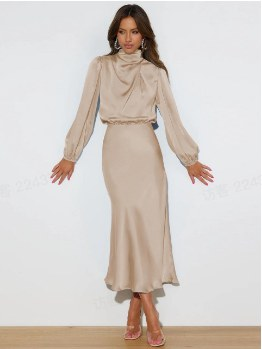 飞书文档 - 图片</td>
<td >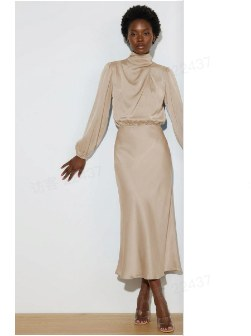 飞书文档 - 图片</td>
</tr>
<tr>
<td >商品替换</td>
<td > 飞书文档 - 图片</td>
<td >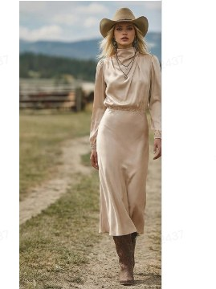 飞书文档 - 图片</td>
</tr>
<tr>
<td >商品主图</td>
<td >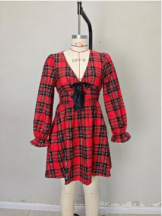 飞书文档 - 图片</td>
<td >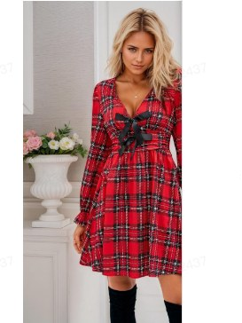 飞书文档 - 图片</td>
</tr>
<tr>
<td >场景图</td>
<td >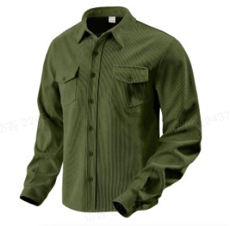 飞书文档 - 图片</td>
<td > 飞书文档 - 图片</td>
</tr>
<tr>
<td >细节特写图</td>
<td >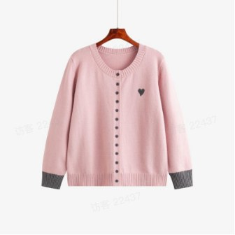 飞书文档 - 图片</td>
<td >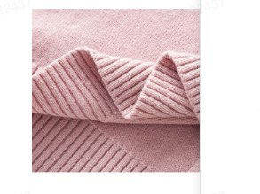 飞书文档 - 图片 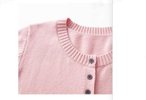 飞书文档 - 图片</td>
</tr>
<tr>
<td >商品卖点图</td>
<td >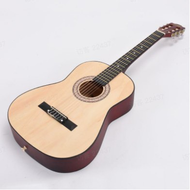 飞书文档 - 图片 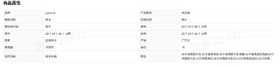 飞书文档 - 图片</td>
<td >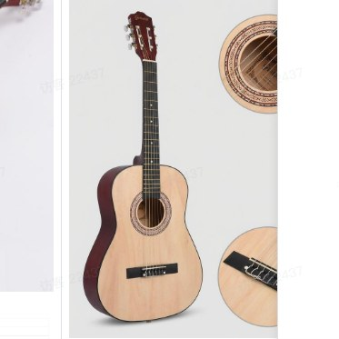 飞书文档 - 图片</td>
</tr>
<tr>
<td >加卖点标注</td>
<td >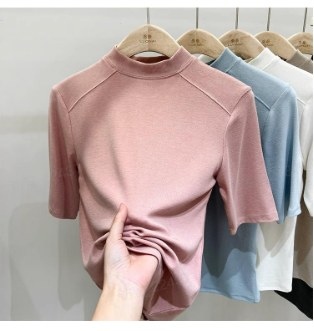 飞书文档 - 图片 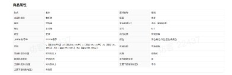 飞书文档 - 图片</td>
<td >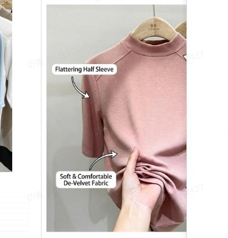 飞书文档 - 图片</td>
</tr>
<tr>
<td >角度图</td>
<td >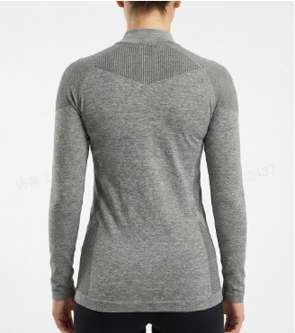 飞书文档 - 图片</td>
<td >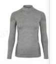 飞书文档 - 图片 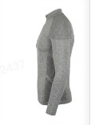 飞书文档 - 图片 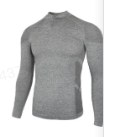 飞书文档 - 图片</td>
</tr>
<tr>
<td >尺码对比图</td>
<td >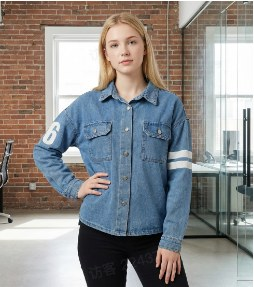 飞书文档 - 图片 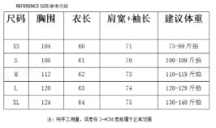 飞书文档 - 图片</td>
<td >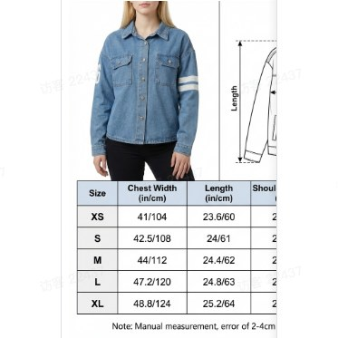 飞书文档 - 图片</td>
</tr>
<tr>
<td >服装3D图</td>
<td >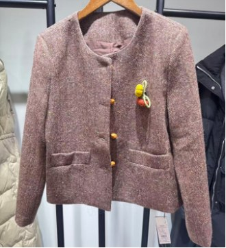 飞书文档 - 图片</td>
<td >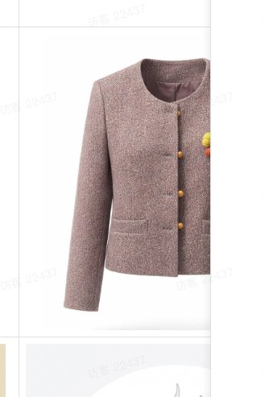 飞书文档 - 图片</td>
</tr>
<tr>
<td >创意素材</td>
<td > 飞书文档 - 图片</td>
<td >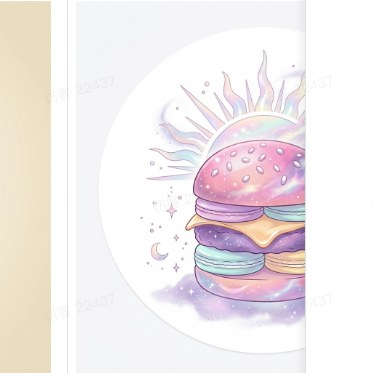 飞书文档 - 图片</td>
</tr>
<tr>
<td >图案提取</td>
<td >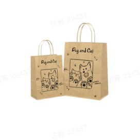 飞书文档 - 图片 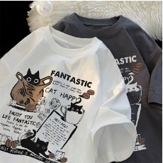 飞书文档 - 图片</td>
<td >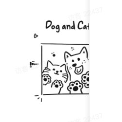 飞书文档 - 图片 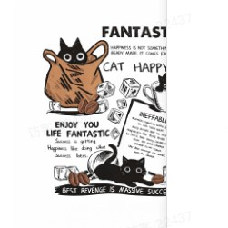 飞书文档 - 图片</td>
</tr>
<tr>
<td >参考生单图</td>
<td > 飞书文档 - 图片</td>
<td >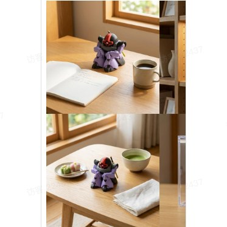 飞书文档 - 图片</td>
</tr>
<tr>
<td >参考生套图</td>
<td >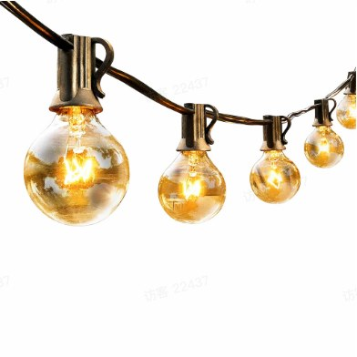 飞书文档 - 图片</td>
<td > 飞书文档 - 图片  飞书文档 - 图片</td>
</tr>
<tr>
<td >Listing套图/详情页套图</td>
<td >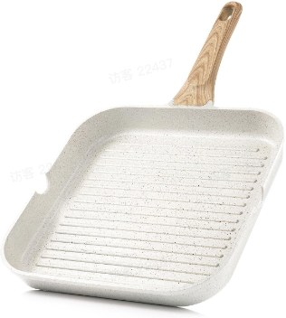 飞书文档 - 图片</td>
<td >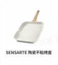 飞书文档 - 图片 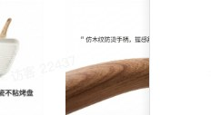 飞书文档 - 图片 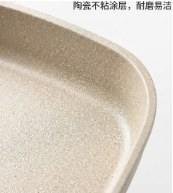 飞书文档 - 图片 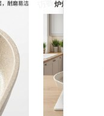 飞书文档 - 图片 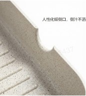 飞书文档 - 图片 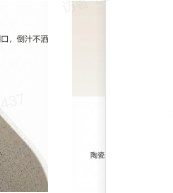 飞书文档 - 图片</td>
</tr>
<tr>
<td >场景裂变</td>
<td > 飞书文档 - 图片 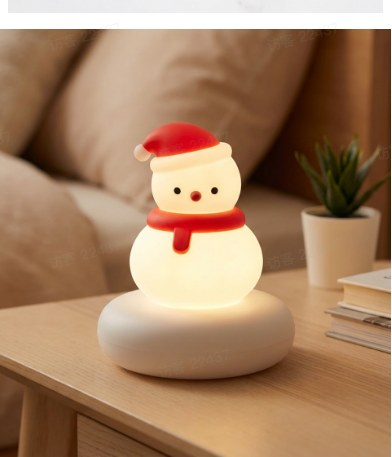 飞书文档 - 图片</td>
<td >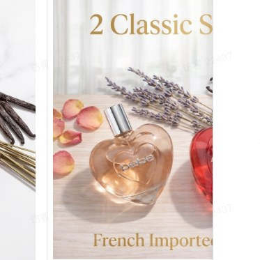 飞书文档 - 图片 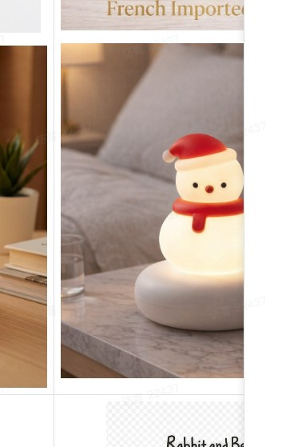 飞书文档 - 图片</td>
</tr>
<tr>
<td >图案裂变</td>
<td >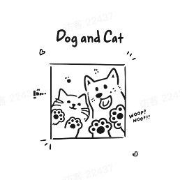 飞书文档 - 图片  飞书文档 - 图片</td>
<td >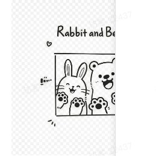 飞书文档 - 图片  飞书文档 - 图片</td>
</tr>
<tr>
<td >款式裂变</td>
<td >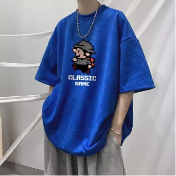 飞书文档 - 图片</td>
<td > 飞书文档 - 图片  飞书文档 - 图片  飞书文档 - 图片  飞书文档 - 图片</td>
</tr>
<tr>
<td >换颜色</td>
<td > 飞书文档 - 图片</td>
<td > 飞书文档 - 图片</td>
</tr>
<tr>
<td >换动作</td>
<td > 飞书文档 - 图片</td>
<td > 飞书文档 - 图片</td>
</tr>
<tr>
<td >换场景</td>
<td > 飞书文档 - 图片</td>
<td > 飞书文档 - 图片</td>
</tr>
</table>

## AI 修图

<table>
<tr>
<td >卖倍 AI 功能</td>
<td >用户输入</td>
<td >卖倍 AI 输出</td>
</tr>
<tr>
<td >图片翻译</td>
<td > 飞书文档 - 图片</td>
<td > 飞书文档 - 图片</td>
</tr>
<tr>
<td >文字编辑</td>
<td > 飞书文档 - 图片</td>
<td > 飞书文档 - 图片</td>
</tr>
<tr>
<td >局部重绘</td>
<td > 飞书文档 - 图片</td>
<td > 飞书文档 - 图片</td>
</tr>
<tr>
<td >透明图</td>
<td > 飞书文档 - 图片</td>
<td > 飞书文档 - 图片</td>
</tr>
<tr>
<td >去水印</td>
<td > 飞书文档 - 图片</td>
<td > 飞书文档 - 图片</td>
</tr>
<tr>
<td >一键模糊人脸/去人脸</td>
<td > 飞书文档 - 图片</td>
<td > 飞书文档 - 图片</td>
</tr>
<tr>
<td >图片高清化</td>
<td > 飞书文档 - 图片</td>
<td > 飞书文档 - 图片</td>
</tr>
<tr>
<td >调光线</td>
<td > 飞书文档 - 图片</td>
<td > 飞书文档 - 图片</td>
</tr>
<tr>
<td >多平台尺寸自适应裁剪</td>
<td > 飞书文档 - 图片</td>
<td > 飞书文档 - 图片</td>
</tr>
<tr>
<td rowspan="4">拆分图片</td>
<td rowspan="4"> 飞书文档 - 图片</td>
<td > 飞书文档 - 图片</td>
</tr>
<tr>
<td >&nbsp;</td>
<td >&nbsp;</td>
<td > 飞书文档 - 图片</td>
</tr>
<tr>
<td >&nbsp;</td>
<td >&nbsp;</td>
<td > 飞书文档 - 图片</td>
</tr>
<tr>
<td >&nbsp;</td>
<td >&nbsp;</td>
<td > 飞书文档 - 图片</td>
</tr>
<tr>
<td >自定义生图</td>
<td > 飞书文档 - 图片  飞书文档 - 图片  飞书文档 - 图片  飞书文档 - 图片  飞书文档 - 图片</td>
<td > 飞书文档 - 图片</td>
</tr>
</table>

## 更多品类效果

### 🔶服饰箱包

<table>
<tr>
<td >单品</td>
<td >用户输入</td>
<td >卖倍 AI 输出</td>
</tr>
<tr>
<td >黑色紧身吊带裙-生成套图</td>
<td >正面  侧面 正面  正面 侧面  飞书文档 - 图片 侧面  背面</td>
<td > 飞书文档 - 图片  飞书文档 - 图片  飞书文档 - 图片  飞书文档 - 图片  飞书文档 - 图片  飞书文档 - 图片</td>
</tr>
<tr>
<td >宽松棉麻女衬衫 (胖/瘦模特穿搭效果)</td>
<td > 飞书文档 - 图片</td>
<td >瘦模特效果  大码效果 瘦模特效果  瘦模特效果 大码效果  大码效果</td>
</tr>
<tr>
<td >女菱格棉服 (多国本地化模特)</td>
<td > 飞书文档 - 图片</td>
<td >马来西亚  南美 马来西亚  马来西亚 南美  南美 泰国  印尼 泰国  泰国 印尼  印尼</td>
</tr>
<tr>
<td >棕色皮衣 (不同气质的模特)</td>
<td > 飞书文档 - 图片</td>
<td >甜美型  高冷型 甜美型  甜美型 高冷型  高冷型</td>
</tr>
<tr>
<td >运动健身沙滩男士五分裤</td>
<td > 飞书文档 - 图片  飞书文档 - 图片</td>
<td > 飞书文档 - 图片</td>
</tr>
<tr>
<td >红色鸭舌帽</td>
<td > 飞书文档 - 图片</td>
<td > 飞书文档 - 图片</td>
</tr>
<tr>
<td >英伦风粗跟高筒骑士女靴</td>
<td > 飞书文档 - 图片</td>
<td > 飞书文档 - 图片</td>
</tr>
<tr>
<td >挂脖性感长裙</td>
<td > 飞书文档 - 图片</td>
<td > 飞书文档 - 图片</td>
</tr>
<tr>
<td >高弹力新款轻柔高弹带杯螺纹瑜伽背心</td>
<td > 飞书文档 - 图片  飞书文档 - 图片</td>
<td > 飞书文档 - 图片</td>
</tr>
<tr>
<td >挂脖红色连衣裙-多品组合</td>
<td > 飞书文档 - 图片  飞书文档 - 图片  飞书文档 - 图片</td>
<td > 飞书文档 - 图片</td>
</tr>
<tr>
<td >粉色针织毛衣+棕色西装裤参考生单图</td>
<td > 飞书文档 - 图片</td>
<td > 飞书文档 - 图片</td>
</tr>
<tr>
<td >棕色裙子套装-参考生单图</td>
<td > 飞书文档 - 图片</td>
<td > 飞书文档 - 图片</td>
</tr>
<tr>
<td >韩系灰色套装-参考生单图</td>
<td > 飞书文档 - 图片</td>
<td > 飞书文档 - 图片</td>
</tr>
<tr>
<td >独立站热卖非洲女孩蝴蝶手提包单肩包斜挎包</td>
<td > 飞书文档 - 图片  飞书文档 - 图片  飞书文档 - 图片</td>
<td > 飞书文档 - 图片  飞书文档 - 图片  飞书文档 - 图片  飞书文档 - 图片  飞书文档 - 图片  飞书文档 - 图片</td>
</tr>
<tr>
<td >小鸡腿包-参考生套图</td>
<td > 飞书文档 - 图片</td>
<td > 飞书文档 - 图片</td>
</tr>
<tr>
<td >蓝色毛衣-参考生单图</td>
<td > 飞书文档 - 图片  飞书文档 - 图片  飞书文档 - 图片</td>
<td > 飞书文档 - 图片</td>
</tr>
<tr>
<td >牛仔裤 - 模特穿搭</td>
<td > 飞书文档 - 图片</td>
<td > 飞书文档 - 图片  飞书文档 - 图片</td>
</tr>
<tr>
<td >牛仔裤 - 模特穿搭</td>
<td > 飞书文档 - 图片  飞书文档 - 图片</td>
<td > 飞书文档 - 图片  飞书文档 - 图片</td>
</tr>
<tr>
<td >时尚女装 - 模特换装</td>
<td > 飞书文档 - 图片</td>
<td > 飞书文档 - 图片  飞书文档 - 图片</td>
</tr>
<tr>
<td >时尚女装 - 模特换装</td>
<td > 飞书文档 - 图片</td>
<td > 飞书文档 - 图片  飞书文档 - 图片</td>
</tr>
<tr>
<td >时尚女装 - 模特换动作</td>
<td > 飞书文档 - 图片</td>
<td > 飞书文档 - 图片  飞书文档 - 图片</td>
</tr>
<tr>
<td >儿童女装 - 模特穿搭</td>
<td > 飞书文档 - 图片</td>
<td > 飞书文档 - 图片</td>
</tr>
<tr>
<td >儿童女装 - 参考生图</td>
<td > 飞书文档 - 图片  飞书文档 - 图片  飞书文档 - 图片</td>
<td > 飞书文档 - 图片  飞书文档 - 图片</td>
</tr>
</table>

### 🔶鞋类

<table>
<tr>
<td >交叉女士平底鞋-换颜色</td>
<td > 飞书文档 - 图片</td>
<td > 飞书文档 - 图片</td>
</tr>
<tr>
<td >男士皮鞋-细节图</td>
<td > 飞书文档 - 图片  飞书文档 - 图片</td>
<td > 飞书文档 - 图片</td>
</tr>
<tr>
<td >儿童鞋-换颜色</td>
<td >- 把所有的橙色换成 #7AC5CD 色  飞书文档 - 图片</td>
<td > 飞书文档 - 图片</td>
</tr>
</table>

### 🔶饰品

<table>
<tr>
<td >单品</td>
<td >用户输入</td>
<td >卖倍 AI 输出</td>
</tr>
<tr>
<td >间色水晶锆石手链 -  套图</td>
<td > 飞书文档 - 图片  飞书文档 - 图片</td>
<td > 飞书文档 - 图片  飞书文档 - 图片  飞书文档 - 图片  飞书文档 - 图片  飞书文档 - 图片  飞书文档 - 图片</td>
</tr>
<tr>
<td >钛钢嵌钻项链-模特穿戴</td>
<td > 飞书文档 - 图片</td>
<td > 飞书文档 - 图片</td>
</tr>
<tr>
<td >金色拉丝大气耳钉-场景图</td>
<td > 飞书文档 - 图片</td>
<td > 飞书文档 - 图片</td>
</tr>
<tr>
<td >石珠手链-套图</td>
<td > 飞书文档 - 图片</td>
<td > 飞书文档 - 图片  飞书文档 - 图片  飞书文档 - 图片  飞书文档 - 图片</td>
</tr>
<tr>
<td >珍珠锁骨链-套图</td>
<td > 飞书文档 - 图片</td>
<td > 飞书文档 - 图片  飞书文档 - 图片  飞书文档 - 图片  飞书文档 - 图片</td>
</tr>
<tr>
<td >粉色珍珠耳钉-套图</td>
<td > 飞书文档 - 图片</td>
<td > 飞书文档 - 图片  飞书文档 - 图片  飞书文档 - 图片  飞书文档 - 图片</td>
</tr>
<tr>
<td >开口可调节手镯-套图</td>
<td > 飞书文档 - 图片</td>
<td > 飞书文档 - 图片  飞书文档 - 图片  飞书文档 - 图片  飞书文档 - 图片</td>
</tr>
<tr>
<td >大肠发圈-换颜色</td>
<td > 飞书文档 - 图片</td>
<td > 飞书文档 - 图片</td>
</tr>
<tr>
<td >蝴蝶结图案发箍-细节图</td>
<td > 飞书文档 - 图片</td>
<td > 飞书文档 - 图片</td>
</tr>
<tr>
<td >水晶戒指-场景图</td>
<td > 飞书文档 - 图片  飞书文档 - 图片</td>
<td > 飞书文档 - 图片</td>
</tr>
<tr>
<td >天鹅胸针-细节图</td>
<td > 飞书文档 - 图片  飞书文档 - 图片</td>
<td > 飞书文档 - 图片</td>
</tr>
<tr>
<td >眼镜-穿戴图</td>
<td > 飞书文档 - 图片</td>
<td > 飞书文档 - 图片</td>
</tr>
<tr>
<td >中式丝绒蚕丝绒花仿点发簪-穿戴图</td>
<td > 飞书文档 - 图片</td>
<td > 飞书文档 - 图片</td>
</tr>
</table>

### 🔶家居

<table>
<tr>
<td >单品</td>
<td >用户输入</td>
<td >卖倍 AI 输出</td>
</tr>
<tr>
<td >奶油沙发-人物场景图</td>
<td > 飞书文档 - 图片</td>
<td > 飞书文档 - 图片</td>
</tr>
<tr>
<td >单人懒人布艺沙发-场景图</td>
<td > 飞书文档 - 图片</td>
<td > 飞书文档 - 图片</td>
</tr>
<tr>
<td >宝宝婴儿衣服挂衣式收纳柜-场景图</td>
<td > 飞书文档 - 图片</td>
<td > 飞书文档 - 图片</td>
</tr>
<tr>
<td >小雪人小夜灯-场景图</td>
<td > 飞书文档 - 图片</td>
<td > 飞书文档 - 图片</td>
</tr>
<tr>
<td >浴室橱柜-场景图</td>
<td > 飞书文档 - 图片</td>
<td > 飞书文档 - 图片</td>
</tr>
<tr>
<td >香薰-套图</td>
<td > 飞书文档 - 图片</td>
<td > 飞书文档 - 图片  飞书文档 - 图片  飞书文档 - 图片  飞书文档 - 图片  飞书文档 - 图片  飞书文档 - 图片</td>
</tr>
</table>

### 🔶美妆个护

<table>
<tr>
<td >单品</td>
<td >用户输入</td>
<td >卖倍 AI 输出</td>
</tr>
<tr>
<td >淡香水果味香水 - 套图</td>
<td > 飞书文档 - 图片</td>
<td > 飞书文档 - 图片  飞书文档 - 图片  飞书文档 - 图片  飞书文档 - 图片  飞书文档 - 图片  飞书文档 - 图片</td>
</tr>
<tr>
<td >粉魅甜心香水 - 场景图</td>
<td > 飞书文档 - 图片</td>
<td > 飞书文档 - 图片</td>
</tr>
<tr>
<td >清雅仙气少女穿戴甲 - 场景图</td>
<td > 飞书文档 - 图片</td>
<td > 飞书文档 - 图片</td>
</tr>
<tr>
<td >圣罗兰口红- 套图</td>
<td > 飞书文档 - 图片</td>
<td > 飞书文档 - 图片  飞书文档 - 图片  飞书文档 - 图片  飞书文档 - 图片  飞书文档 - 图片  飞书文档 - 图片</td>
</tr>
<tr>
<td >护手霜- 套图</td>
<td > 飞书文档 - 图片</td>
<td > 飞书文档 - 图片  飞书文档 - 图片  飞书文档 - 图片</td>
</tr>
<tr>
<td >洗面奶-参考生套图</td>
<td > 飞书文档 - 图片</td>
<td > 飞书文档 - 图片  飞书文档 - 图片  飞书文档 - 图片  飞书文档 - 图片  飞书文档 - 图片  飞书文档 - 图片</td>
</tr>
<tr>
<td >芦荟胶-参考生套图</td>
<td > 飞书文档 - 图片</td>
<td > 飞书文档 - 图片  飞书文档 - 图片  飞书文档 - 图片  飞书文档 - 图片  飞书文档 - 图片  飞书文档 - 图片</td>
</tr>
<tr>
<td >护发素-参考生套图</td>
<td > 飞书文档 - 图片</td>
<td > 飞书文档 - 图片</td>
</tr>
<tr>
<td >金流沙香水-单图转视频</td>
<td >&nbsp;</td>
<td >&nbsp;</td>
</tr>
</table>

### 🔶家居用品

<table>
<tr>
<td >单品</td>
<td >用户输入</td>
<td >卖倍 AI 输出</td>
</tr>
<tr>
<td >保温杯-场景图</td>
<td > 飞书文档 - 图片</td>
<td > 飞书文档 - 图片</td>
</tr>
<tr>
<td >马到成功马克杯-尺码对比图</td>
<td > 飞书文档 - 图片</td>
<td > 飞书文档 - 图片</td>
</tr>
<tr>
<td >陶瓷猫猫杯-单图转视频</td>
<td > 飞书文档 - 图片</td>
<td > generated-video-1 (14) 00:00</td>
</tr>
<tr>
<td >植物香薰-参考生套图</td>
<td > 飞书文档 - 图片</td>
<td > 飞书文档 - 图片</td>
</tr>
</table>

### 🔶宠物

<table>
<tr>
<td >单品</td>
<td >用户输入</td>
<td >卖倍 AI 输出</td>
</tr>
<tr>
<td >仓鼠窝-场景图</td>
<td > 飞书文档 - 图片</td>
<td > 飞书文档 - 图片</td>
</tr>
<tr>
<td >大狗狗衣服-尺码图</td>
<td > 飞书文档 - 图片  飞书文档 - 图片</td>
<td > 飞书文档 - 图片</td>
</tr>
<tr>
<td >猫窝-套图</td>
<td > 飞书文档 - 图片</td>
<td > 飞书文档 - 图片  飞书文档 - 图片  飞书文档 - 图片  飞书文档 - 图片  飞书文档 - 图片  飞书文档 - 图片</td>
</tr>
<tr>
<td >背心式猫狗牵引绳-套图</td>
<td > 飞书文档 - 图片</td>
<td > 飞书文档 - 图片  飞书文档 - 图片  飞书文档 - 图片  飞书文档 - 图片  飞书文档 - 图片  飞书文档 - 图片</td>
</tr>
</table>

### 🔶玩具

<table>
<tr>
<td >单品</td>
<td >用户输入</td>
<td >卖倍 AI 输出</td>
</tr>
<tr>
<td >越野玩具车-多视角图</td>
<td > 飞书文档 - 图片</td>
<td > 飞书文档 - 图片  飞书文档 - 图片</td>
</tr>
<tr>
<td >搞怪仙人掌-卖点图</td>
<td > 飞书文档 - 图片</td>
<td > 飞书文档 - 图片</td>
</tr>
<tr>
<td >加特林大水枪-套图</td>
<td > 飞书文档 - 图片</td>
<td > 飞书文档 - 图片  飞书文档 - 图片  飞书文档 - 图片  飞书文档 - 图片</td>
</tr>
<tr>
<td >仙女翅膀-换颜色</td>
<td > 飞书文档 - 图片</td>
<td > 飞书文档 - 图片</td>
</tr>
<tr>
<td >HG陆战高达-套图</td>
<td > 飞书文档 - 图片</td>
<td > 飞书文档 - 图片  飞书文档 - 图片  飞书文档 - 图片  飞书文档 - 图片</td>
</tr>
<tr>
<td >MG全装甲高达-套图</td>
<td > 飞书文档 - 图片</td>
<td > 飞书文档 - 图片</td>
</tr>
<tr>
<td >扭蛋大魔手办-套图</td>
<td > 飞书文档 - 图片</td>
<td > 飞书文档 - 图片  飞书文档 - 图片  飞书文档 - 图片  飞书文档 - 图片</td>
</tr>
<tr>
<td >猪猪扎古手办-套图</td>
<td > 飞书文档 - 图片</td>
<td > 飞书文档 - 图片  飞书文档 - 图片  飞书文档 - 图片  飞书文档 - 图片  飞书文档 - 图片  飞书文档 - 图片</td>
</tr>
<tr>
<td >胜利飞燕号-套图</td>
<td > 飞书文档 - 图片</td>
<td > 飞书文档 - 图片  飞书文档 - 图片  飞书文档 - 图片  飞书文档 - 图片  飞书文档 - 图片  飞书文档 - 图片</td>
</tr>
<tr>
<td >小白毛绒玩偶-套图</td>
<td > 飞书文档 - 图片</td>
<td > 飞书文档 - 图片  飞书文档 - 图片  飞书文档 - 图片  飞书文档 - 图片  飞书文档 - 图片  飞书文档 - 图片</td>
</tr>
</table>

### 🔶母婴

<table>
<tr>
<td >单品</td>
<td >用户输入</td>
<td >卖倍 AI 输出</td>
</tr>
<tr>
<td >恐龙餐盘套装-套图</td>
<td > 飞书文档 - 图片</td>
<td > 飞书文档 - 图片  飞书文档 - 图片  飞书文档 - 图片  飞书文档 - 图片</td>
</tr>
<tr>
<td >婴儿枕头-细节图</td>
<td > 飞书文档 - 图片</td>
<td > 飞书文档 - 图片</td>
</tr>
<tr>
<td >奶粉分装盒-场景图</td>
<td > 飞书文档 - 图片</td>
<td > 飞书文档 - 图片</td>
</tr>
<tr>
<td >手柄塑料奶瓶-尺码图</td>
<td > 飞书文档 - 图片  飞书文档 - 图片</td>
<td > 飞书文档 - 图片</td>
</tr>
<tr>
<td >婴儿花瓣口水巾-标记图</td>
<td > 飞书文档 - 图片</td>
<td > 飞书文档 - 图片</td>
</tr>
</table>

### 🔶文化

<table>
<tr>
<td >单品</td>
<td >用户输入</td>
<td >卖倍 AI 输出</td>
</tr>
<tr>
<td >按动签字笔-手模图</td>
<td > 飞书文档 - 图片</td>
<td > 飞书文档 - 图片</td>
</tr>
<tr>
<td >马年红包-套图</td>
<td > 飞书文档 - 图片</td>
<td > 飞书文档 - 图片  飞书文档 - 图片  飞书文档 - 图片  飞书文档 - 图片  飞书文档 - 图片  飞书文档 - 图片</td>
</tr>
<tr>
<td >新年快乐窗花-套图</td>
<td > 飞书文档 - 图片</td>
<td > 飞书文档 - 图片  飞书文档 - 图片  飞书文档 - 图片  飞书文档 - 图片</td>
</tr>
<tr>
<td >小提琴-套图</td>
<td > 飞书文档 - 图片</td>
<td > 飞书文档 - 图片</td>
</tr>
<tr>
<td >贝斯-套图</td>
<td > 飞书文档 - 图片</td>
<td > 飞书文档 - 图片  飞书文档 - 图片  飞书文档 - 图片  飞书文档 - 图片  飞书文档 - 图片  飞书文档 - 图片</td>
</tr>
<tr>
<td >方大同专辑-套图</td>
<td > 飞书文档 - 图片</td>
<td > 飞书文档 - 图片  飞书文档 - 图片  飞书文档 - 图片  飞书文档 - 图片  飞书文档 - 图片  飞书文档 - 图片</td>
</tr>
</table>

### 🔶3C产品

<table>
<tr>
<td >单品</td>
<td >用户输入</td>
<td >卖倍 AI 输出</td>
</tr>
<tr>
<td >儿童手表 - 产品listing套图</td>
<td > 飞书文档 - 图片</td>
<td > 飞书文档 - 图片  飞书文档 - 图片  飞书文档 - 图片  飞书文档 - 图片</td>
</tr>
<tr>
<td >蓝牙音箱 - 主图</td>
<td > 飞书文档 - 图片</td>
<td > 飞书文档 - 图片</td>
</tr>
<tr>
<td >键盘 - 主图</td>
<td > 飞书文档 - 图片</td>
<td > 飞书文档 - 图片</td>
</tr>
<tr>
<td >罗技鼠标 - 主图</td>
<td > 飞书文档 - 图片</td>
<td > 飞书文档 - 图片</td>
</tr>
<tr>
<td >头戴式耳机 - 主图</td>
<td > 飞书文档 - 图片</td>
<td > 飞书文档 - 图片</td>
</tr>
<tr>
<td >蓝牙耳机 - 主图</td>
<td > 飞书文档 - 图片</td>
<td > 飞书文档 - 图片</td>
</tr>
</table>

## 二、客户成功案例

### 案例1：某服装档口店老板 - 批量生模特图

- 以前：找设计工作室设计模特图，等3天还拿不到；自己PS又不会，拍真人更贵又慢。

- 现在：只需1张衣服正面图/商品人台图 + 选好模特参数（肤色/年龄/国籍/身材/姿势），30分钟内AI自动批量生成200张真人上身图！

- 效果：月省3000+，效率提升60%，再也不用求人、修图、租场地！卖倍 AI 直接交付效果图片。

<table>
<tr>
<td >用户输入</td>
<td >卖倍 AI 输出</td>
</tr>
<tr>
<td > 飞书文档 - 图片</td>
<td > 飞书文档 - 图片</td>
</tr>
<tr>
<td > 飞书文档 - 图片</td>
<td > 飞书文档 - 图片</td>
</tr>
</table>

### 案例2：某东南亚跨境电商配饰卖家 - 生成真实好评买家秀

- 以前：商品评价页面里，总缺“真实买家秀”；等客户主动晒图，又一个月收不到 3 张；自己P图，又费时费力，而且商品数量那么多，根本忙不过来。

- 现在：只需上传商品图，卖倍 AI 1 分钟内生成各种不同角度的手持/佩戴首饰的真实感买家秀图片。

- 效果：商品收藏量翻 5 倍，下单率翻 2.4 倍。

<table>
<tr>
<td >用户输入</td>
<td >卖倍 AI 输出</td>
</tr>
<tr>
<td > 飞书文档 - 图片</td>
<td > 飞书文档 - 图片</td>
</tr>
<tr>
<td > 飞书文档 - 图片</td>
<td > 飞书文档 - 图片</td>
</tr>
</table>

### 案例3：某跨境电商卖家 - 低成本翻译素材

- 以前：不但要外包美工修改文案，还需要自己先翻译成本土化文案，比对了谷歌翻译又比对其他各种翻译软件，还不确定文案是不是本土化。

- 现在：用卖倍 AI，1套素材 → 10分钟自动翻译成3种不同语言，直接复用！

- 效果：现在10分钟搞定，成本省70%，时间省90%！

<table>
<tr>
<td >用户输入</td>
<td >卖倍 AI 输出</td>
</tr>
<tr>
<td rowspan="3"> 飞书文档 - 图片</td>
<td > 飞书文档 - 图片</td>
</tr>
<tr>
<td >&nbsp;</td>
<td > 飞书文档 - 图片</td>
</tr>
<tr>
<td >&nbsp;</td>
<td > 飞书文档 - 图片</td>
</tr>
</table>

### 案例4：某外贸 B2B 运营 - 批量处理手拍商品图为白底图/透明图

- 以前：每天要处理几百张工厂提供的商品图，还在等美工抠白底；急着上新但是美工说“现在有优先级更高的任务要完成”；自己用 PS？边缘毛糙、发丝糊成团不能忍…

- 现在：用卖倍 AI，上传图片 → 一键生成白底/透明底图，10 秒出图，效果干净到像专业修图！

- 效果：现在自己 10 分钟搞定 100 张，成本归零，上新速度翻 3 倍！

<table>
<tr>
<td >用户输入</td>
<td >卖倍 AI 输出</td>
</tr>
<tr>
<td > 飞书文档 - 图片</td>
<td > 飞书文档 - 图片</td>
</tr>
</table>
