# 卖倍 AI 案例合集（生视频）

Source: https://ecnaj5aj95hg.feishu.cn/wiki/OMGywWLLwiHc6ckr44RcXYQQnTb
Modified: 2026-04-08T04:18:22.000Z

## 一、卖倍 AI 功能案例

## 视频素材制作（适用于裂变多样化素材、混剪视频去重）

### 单图转视频

> 适用场景：仅有商品主图，需快速生成动态展示视频；可以制作的视频类别包括氛围感推动、推拉运镜、模特微动作、质感特写、场景拓展等；

### 多图转视频

> 适用场景：拥有多个商品角度/场景图/颜色等，需整合为连贯带货视频，更全方位展示商品全貌；

### 首尾帧生视频

> 适用场景：已有明确的起始画面与结束画面，需要AI自动生成中间过渡动画；可以制作的视频类型包括状态变化演示、场景切换过渡、产品变形展示、角色动作衔接、Before & After对比等；

#### 案例1：氛围感微动

1. 适用产品： 香薰蜡烛、咖啡、床品、护肤品、香水

2. 你有什么： 一张商品静物图。 干净背景，光线柔和。

3. 做什么
  - 生成图片素材：上传商品图到卖倍 AI，生成场景图
  - 图转视频：描述火焰/热气/光影 + 动态强度：微弱（避免过度晃动），生成 5 秒循环视频

4. 得到什么 ：蜡烛火焰轻轻跳动。 咖啡热气缓缓上升。 比静图多了呼吸感。

<table>
<tr>
<td >用户输入</td>
<td >卖倍 AI 输出</td>
</tr>
<tr>
<td > 飞书文档 - 图片</td>
<td > 1月28日 00:08</td>
</tr>
</table>

#### 案例2：口播介绍

1. 适用产品： 所有需要讲解的产品。 护肤品成分、数码产品功能、食品制作、课程预告。

2. 你有什么： 产品图。 想说的话（50-200字）。

3. 做什么
  a. 卖点分析以及文案生成：上传产品图到 Deepseek 或者其他 AI 产品，让它生成卖点和讲解文案
  b. 生成图片素材：用 MaybeAI 生成产品在使用人物在场景里的图
  c. 图转视频：输入文案，以及图片生成口播视频

4. 得到什么 ：数字人对着镜头讲产品。 背景是产品使用场景。

<table>
<tr>
<td >用户输入</td>
<td >卖倍 AI 输出</td>
</tr>
<tr>
<td >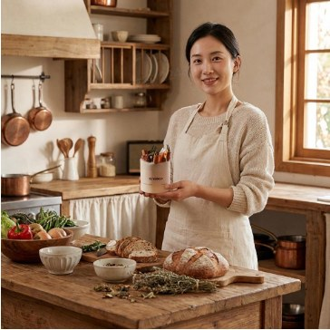 飞书文档 - 图片</td>
<td > generated-video-1 (3) (1) 00:10</td>
</tr>
</table>

#### 案例3：推拉运镜

1. 适用产品：家具、房间全景、服装、户外装备、美食摆盘

2. 你有什么： 产品在环境里的图片。 最好有前后景。

1. 做什么
  - 生成图片素材：上传商品图片到卖倍 AI，生成场景图
  - 图转视频：描述选择运镜方向（推进/拉远） + 横移缓慢，生成 5-10 秒视频

2. 得到什么 ：镜头从远处推进。 聚焦到产品细节。 像电影开场。

<table>
<tr>
<td >用户输入</td>
<td >卖倍 AI 输出</td>
</tr>
<tr>
<td >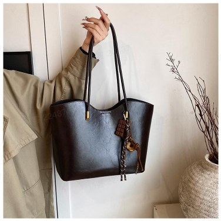 飞书文档 - 图片</td>
<td >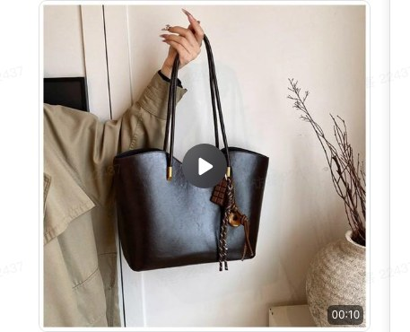 1 00:10</td>
</tr>
</table>

#### 案例4：模特微动作

1. 适用产品：服装、墨镜、香水、口红、饰品

2. 你有什么：模特拿着或穿着产品的照片。 人物正面清晰。

3. 做什么
  a. 生成图片素材：上传商品图到卖倍 AI，生成模特图上身或者手持产品图
  b. 图转视频：选择 1-2 个自然动作（眨眼/微笑/撩头发/举起产品），生成 5 -10 秒视频

4. 得到什么： 模特对着镜头微笑。 或举起香水瓶闻一下，图片活了。

<table>
<tr>
<td >用户输入</td>
<td >卖倍 AI 输出</td>
</tr>
<tr>
<td > 飞书文档 - 图片</td>
<td >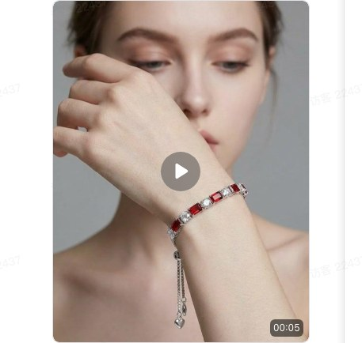 generated-video-1 (12) 00:05</td>
</tr>
</table>

#### 案例5：质感特写

1. 适用产品：蛋糕切片、面霜涂抹、饮料倒入、化妆品质地

2. 你有什么：产品使用场景的静态图， 特写角度最好。

3. 做什么
  a. 生成图片素材：上传商品图到卖倍 AI，生成产品特写图
  b. 图转视频：描述标记动态区域（液体流动/气泡/涂抹）+ 物理效果（重力/粘稠度），生成慢动作视频

4. 得到什么： 面霜涂开的丝滑瞬间。 切开蛋糕的流心画面。 ASMR级视觉体验。

<table>
<tr>
<td >用户输入</td>
<td >卖倍 AI 输出</td>
</tr>
<tr>
<td > 飞书文档 - 图片</td>
<td > generated-video-1 (7) 00:10</td>
</tr>
</table>

#### 案例6：场景扩展

1. 适用产品：品牌故事、节日营销、IP 内容

2. 你有什么：产品特写图。 或品牌核心视觉元素。

3. 做什么
  a. 分析故事场景：上传图片到任意 AI 工具（如卖倍 AI, DeepSeek, ChatGPT, 豆包等）让 AI 分析产品可以延展的故事场景。
  b. 生成提示词：选择故事场景，结合原图，生成图转视频动效提示词，从产品特写开始，无限拉远，揭示出一个意想不到的宏大场景（例如：从蜡烛拉远，发现是在森林里的一个小木屋）。
  c. 图转视频：输入故事场景提示词，生成场景拓展视频。

4. 得到什么： 从蜡烛特写拉到森林木屋。 从咖啡杯拉到整个咖啡馆。 一个产品变成一个世界。

<table>
<tr>
<td >用户输入</td>
<td >卖倍 AI 输出</td>
</tr>
<tr>
<td >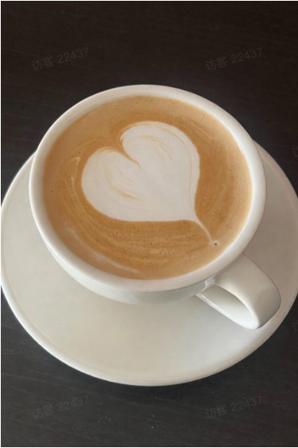 飞书文档 - 图片</td>
<td >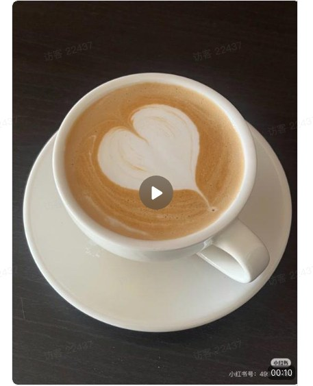 generated-video-1 (8) 00:10</td>
</tr>
</table>

#### 案例7：超现实特效

1. 适用产品：潮牌服饰、电竞装备、盲盒玩具、科技产品、节日限定款

2. 你有什么：产品图。 背景简洁干净最好。

3. 做什么
  a. 生成图片素材：上传产品图到卖倍 AI，生成场景图
  b. 图转视频：描述想要的特效：爆炸/液化/漂浮/变形，以及特效强度，生成 5 秒特效视频

4. 得到什么： 香水瓶炸开变成花朵。 球鞋充气漂浮起来。 产品像魔法一样变化。

<table>
<tr>
<td >用户输入</td>
<td >卖倍 AI 输出</td>
</tr>
<tr>
<td >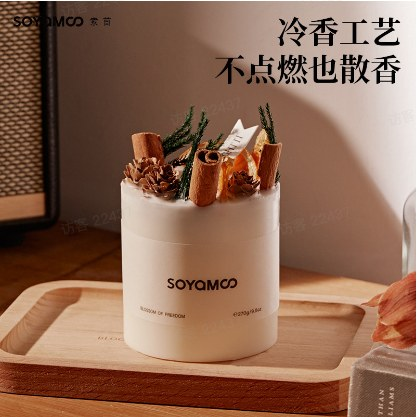 飞书文档 - 图片</td>
<td >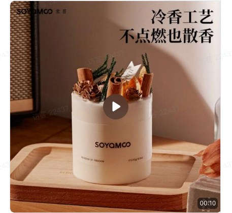 generated-video-1 (6) 00:10</td>
</tr>
</table>

#### 案例8：创始人说

1. 适用产品：品牌故事、新品发布、众筹项目、企业介绍

2. 你有什么：创始人照片。 想传达的品牌理念（100-300字）。

3. 做什么
  a. 口播文案生成：让 AI 根据主题提炼核心故事线（3-5个要点）以及生成分镜口播文案
  b. 生成图片素材：上传创始人照片以及描述采访现场布景，生成采访图片
  c. 图转视频：上传图片以及口播文案，制作采访视频（如需更长时间，可使用多图转视频功能，传入多个图片以及口播文案，生成更长的采访内容）

4. 得到什么： 创始人在不同场景讲品牌。 办公室/产品陈列/使用场景。 比文字更有温度。

<table>
<tr>
<td >用户输入</td>
<td >卖倍 AI 输出</td>
</tr>
<tr>
<td > 飞书文档 - 图片</td>
<td > 采访视频 00:10</td>
</tr>
</table>

## 视频二创翻拍

### 视频翻拍

> 适用场景：翻拍热门爆款视频，获取不同视频分镜，可以选择某一镜头翻拍，或者全视频翻拍

<table>
<tr>
<td >用户输入</td>
<td >用户输入</td>
<td >卖倍 AI 输出</td>
</tr>
<tr>
<td rowspan="2">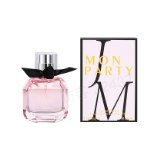 飞书文档 - 图片 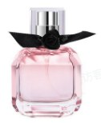 飞书文档 - 图片 用户输入的商品图</td>
<td rowspan="2">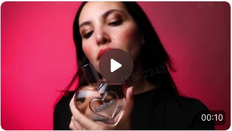 productVideoOptimized (1) 00:10 用户输入的参考视频</td>
<td rowspan="2">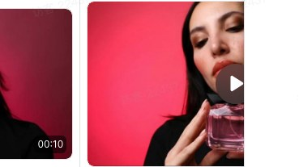 generated-video-1 (11) 00:25</td>
</tr>
<tr>
<td >&nbsp;</td>
<td >&nbsp;</td>
<td >&nbsp;</td>
</tr>
</table>

### 视频元素替换（内测中）

> 适用场景：已有高转化参考视频（如竞品/平台爆款），需快速生成结构一致、适配自有产品的同款视频；

<table>
<tr>
<td >用户输入</td>
<td >卖倍 AI 输出</td>
</tr>
<tr>
<td >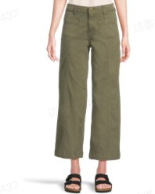 飞书文档 - 图片 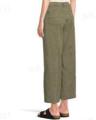 飞书文档 - 图片</td>
<td rowspan="2">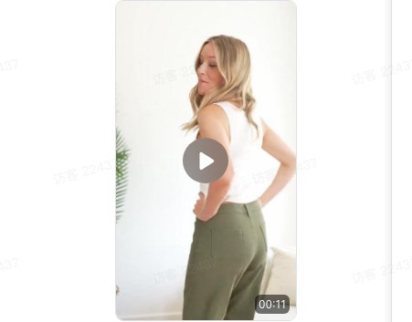 generated-video-1 (3) 00:11</td>
</tr>
<tr>
<td >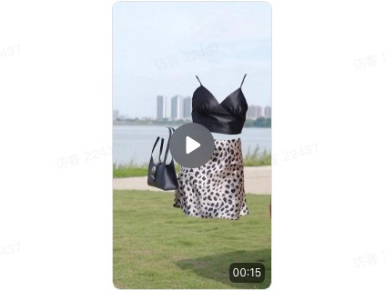 797b9489-d765-4fb7-9aba-5396cf7da066 00:15</td>
<td >&nbsp;</td>
</tr>
</table>

## 智能视频

### 一键生视频

> 适用场景：基于多种大模型，输入视频所属类型、视频要求和商品描述等，AI直接生成高质量种草视频，涵盖场景搭建、人物动作、镜头语言、字幕，生成即使用；

<table>
<tr>
<td >用户输入</td>
<td >卖倍 AI 输出</td>
</tr>
<tr>
<td >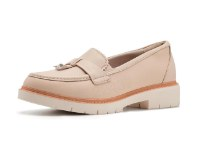 飞书文档 - 图片 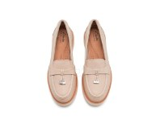 飞书文档 - 图片 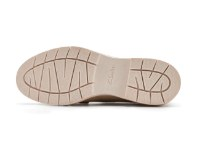 飞书文档 - 图片 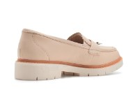 飞书文档 - 图片 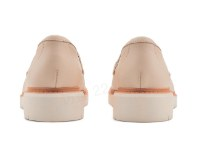 飞书文档 - 图片 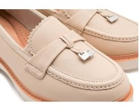 飞书文档 - 图片</td>
<td >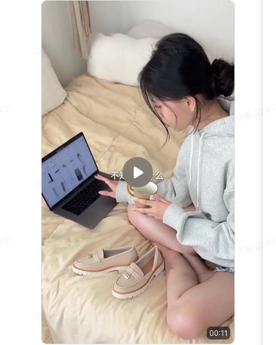 鞋子种草 00:11</td>
</tr>
</table>

### AI导演分镜视频

> 适用场景：你给个想法，AI 给你生成分镜；逐帧精修生成；

## 视频工具

### 视频分析

> 适用场景：识别爆款视频结构及关键分镜，输出可复用的“黄金分镜脚本”；

<table>
<tr>
<td >用户输入</td>
<td >卖倍 AI 输出</td>
</tr>
<tr>
<td >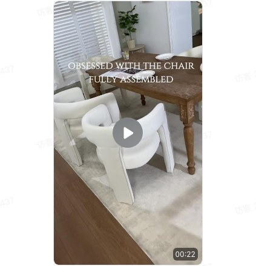 f9a175d7-ea3b-4295-9119-f61c48989cbb 00:00</td>
<td >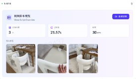 飞书文档 - 图片 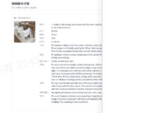 飞书文档 - 图片  飞书文档 - 图片 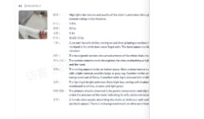 飞书文档 - 图片</td>
</tr>
</table>

### 一键视频合并

> 适用场景：多个视频，AI 帮你一键拼接；

<table>
<tr>
<td >用户输入</td>
<td >卖倍 AI 输出</td>
</tr>
<tr>
<td >1 00:00  1 (1) 00:00 1 00:00  1 00:00 1 (1) 00:00  1 (1) 00:00 1 (3) 00:00  1 (2) 00:00 1 (3) 00:00  1 (3) 00:00 1 (2) 00:00  1 (2) 00:00</td>
<td >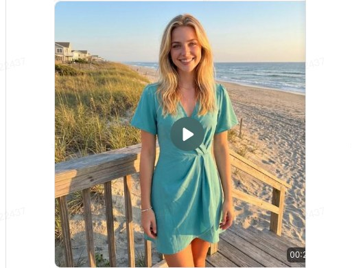 generated-video-1 (4) 00:00</td>
</tr>
</table>

### 视频编辑

> 适用场景：需要快速获取热门视频高光片段，用户素材二次加工和创造；

<table>
<tr>
<td >用户输入</td>
<td >卖倍 AI 输出</td>
</tr>
<tr>
<td >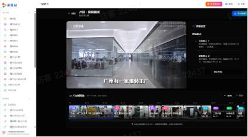 飞书文档 - 图片</td>
<td >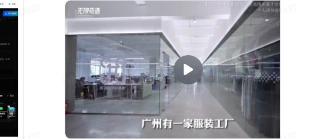 片刻_剪辑_2026-01-19T07-26-35 04:17</td>
</tr>
</table>

## 更多品类效果 - 视频

### 🔶箱包

<table>
<tr>
<td >单品</td>
<td >用户输入</td>
<td >卖倍 AI 输出</td>
</tr>
<tr>
<td >单肩包大容量通勤手提包高级感时尚托特包女</td>
<td >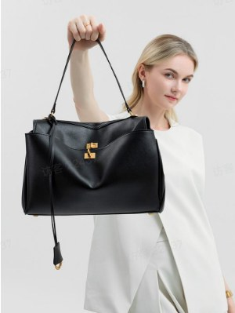 飞书文档 - 图片</td>
<td >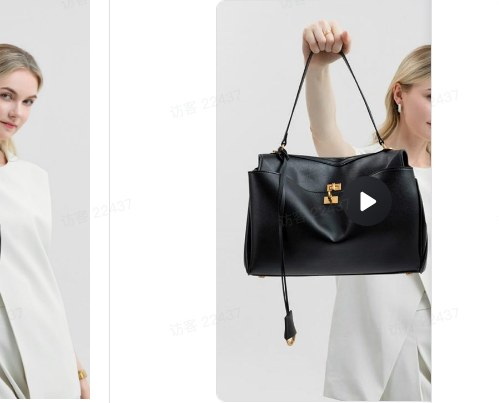 generated-video-1 (1) 00:00</td>
</tr>
<tr>
<td >瑞典潮牌北欧风格邢邵林同款时尚大容量电脑双肩背包男女学生书包</td>
<td >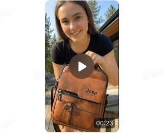 9352623ca58453395b43ee465db5c0ef_raw 00:23 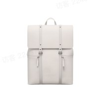 飞书文档 - 图片</td>
<td >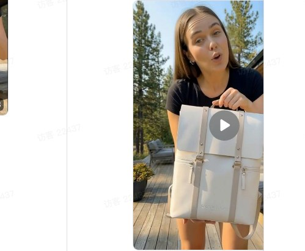 1d04bb87b62937a86cfc0864ae72aa7d_raw 00:21</td>
</tr>
</table>

### 🔶男装

<table>
<tr>
<td >单品</td>
<td >用户输入</td>
<td >卖倍 AI 输出</td>
</tr>
<tr>
<td >黑色衬衫男士长袖高级感痞帅潮春秋轻熟风休闲上衣dk垂感内搭衬衣</td>
<td >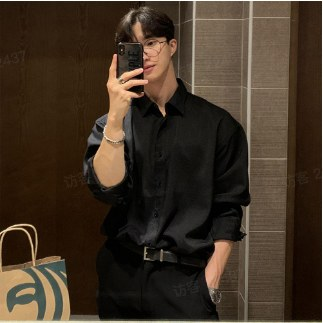 飞书文档 - 图片</td>
<td >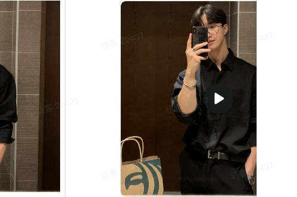 generated-video-1 (9) 00:10</td>
</tr>
<tr>
<td >冰丝短袖t恤男士夏季体恤棉麻纯色宽松打底衫白色五分袖</td>
<td >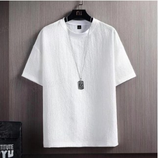 飞书文档 - 图片</td>
<td >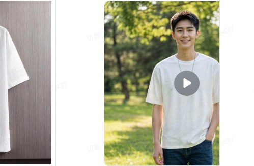 generated-video-1 (11) 00:05</td>
</tr>
<tr>
<td >春秋季休闲运动棉空气层连帽拉链开衫男士夹克</td>
<td >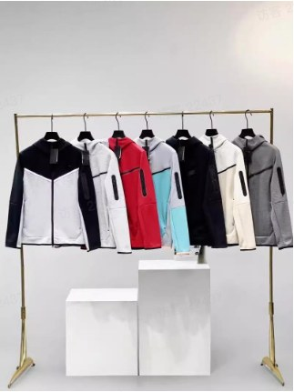 飞书文档 - 图片</td>
<td >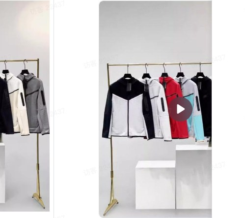 generated-video-1 (10) 00:10</td>
</tr>
<tr>
<td >休闲长裤男款潮流美式高街裤子</td>
<td >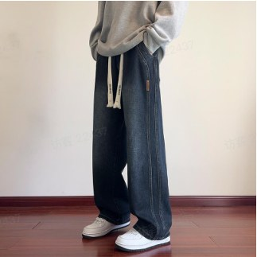 飞书文档 - 图片</td>
<td >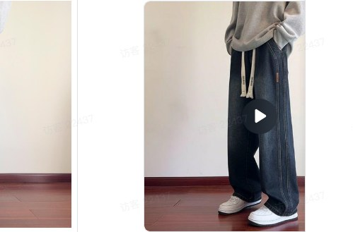 generated-video-1 (12) 00:10</td>
</tr>
</table>

### 🔶女装

<table>
<tr>
<td >单品</td>
<td >用户输入</td>
<td >卖倍 AI 输出</td>
</tr>
<tr>
<td >跨境电商秋冬女装半身裙</td>
<td >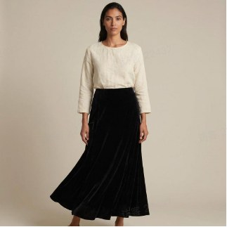 单图生视频</td>
<td >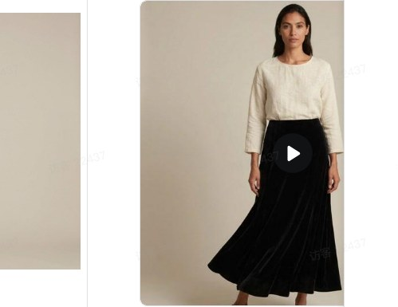 generated-video-1 (2) 00:05</td>
</tr>
<tr>
<td >挂脖红色连衣裙-5s 展示视频</td>
<td >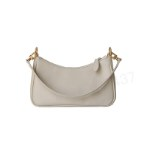 飞书文档 - 图片 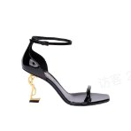 飞书文档 - 图片 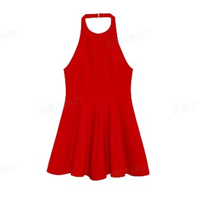 飞书文档 - 图片</td>
<td >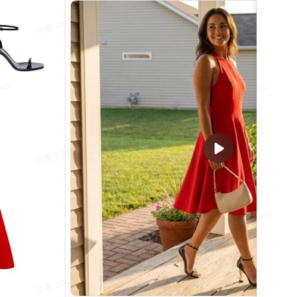 成品 00:05</td>
</tr>
<tr>
<td >黑色紧身吊带裙 - 5s 展示视频</td>
<td >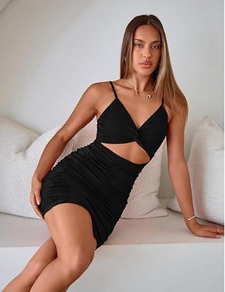 飞书文档 - 图片</td>
<td > 商品5s展示视频 00:05</td>
</tr>
<tr>
<td >红色紧身吊带裙 - 翻拍视频</td>
<td > 飞书文档 - 图片  productVideoOptimized 00:36</td>
<td > 翻拍视频 00:12</td>
</tr>
<tr>
<td >红色卫衣 - 生成种草带货视频</td>
<td > 飞书文档 - 图片</td>
<td > 成图 00:11</td>
</tr>
<tr>
<td >高腰半身裙 - 模特穿戴展示</td>
<td > 飞书文档 - 图片</td>
<td > 修改版裙子成图 00:10</td>
</tr>
</table>

### 🔶童装

<table>
<tr>
<td >单品</td>
<td >用户输入</td>
<td >卖倍 AI 输出</td>
</tr>
<tr>
<td >儿童女牛仔短裤-5s 展示视频</td>
<td > 飞书文档 - 图片</td>
<td > 成品 00:05</td>
</tr>
<tr>
<td >&nbsp;</td>
<td >&nbsp;</td>
<td >&nbsp;</td>
</tr>
</table>

### 🔶鞋类

<table>
<tr>
<td >单品</td>
<td >用户输入</td>
<td >卖倍 AI 输出</td>
</tr>
<tr>
<td >男童凉鞋-5s 展示视频</td>
<td > 飞书文档 - 图片</td>
<td > 成品 00:05</td>
</tr>
<tr>
<td >女童棉拖鞋-5s 展示视频</td>
<td > 飞书文档 - 图片</td>
<td > 成品 00:00</td>
</tr>
<tr>
<td >男士皮鞋-5s 展示视频</td>
<td > 飞书文档 - 图片</td>
<td > 成品 00:05</td>
</tr>
<tr>
<td >交叉女士平底鞋-5s 展示视频</td>
<td > 飞书文档 - 图片</td>
<td > 成品 00:05</td>
</tr>
<tr>
<td >玛丽珍小皮鞋-5s 展示视频</td>
<td > 飞书文档 - 图片</td>
<td > 成品 00:09</td>
</tr>
</table>

### 🔶3C产品

<table>
<tr>
<td >单品</td>
<td >用户输入</td>
<td >卖倍 AI 输出</td>
</tr>
<tr>
<td >高质量小巧随身耳机-种草视频</td>
<td > 飞书文档 - 图片  飞书文档 - 图片  飞书文档 - 图片  飞书文档 - 图片</td>
<td > 3c 耳机使用分享 00:00</td>
</tr>
<tr>
<td >纯黑海景房主机-品牌宣传视频</td>
<td > 飞书文档 - 图片</td>
<td > 成图 00:00</td>
</tr>
<tr>
<td >主板-品牌宣传视频</td>
<td > 飞书文档 - 图片</td>
<td > 主板一键生成种草带货视频 00:00</td>
</tr>
<tr>
<td >硬盘-品牌宣传视频</td>
<td > 飞书文档 - 图片</td>
<td > 硬盘一键生成种草带货视频 00:11</td>
</tr>
<tr>
<td >蓝牙音箱-品牌宣传视频</td>
<td > 飞书文档 - 图片</td>
<td > 蓝牙音箱成图 00:11</td>
</tr>
<tr>
<td >罗技鼠标-品牌宣传视频</td>
<td > 飞书文档 - 图片</td>
<td > 成图修改 00:10</td>
</tr>
<tr>
<td >优盘-品牌宣传视频</td>
<td > 飞书文档 - 图片</td>
<td > 成图 00:11</td>
</tr>
<tr>
<td >键盘-品牌宣传视频</td>
<td > 飞书文档 - 图片</td>
<td > 成图 00:11</td>
</tr>
<tr>
<td >电源-品牌宣传视频</td>
<td > 飞书文档 - 图片</td>
<td > 成图 00:11</td>
</tr>
<tr>
<td >显卡-品牌宣传视频</td>
<td > 飞书文档 - 图片</td>
<td > 成图 00:11</td>
</tr>
</table>

### 🔶饰品

<table>
<tr>
<td >单品</td>
<td >用户输入</td>
<td >卖倍 AI 输出</td>
</tr>
<tr>
<td >间色水晶锆石手链 - 5s 展示视频</td>
<td > 飞书文档 - 图片</td>
<td > generated-video-1 (12) 00:05</td>
</tr>
<tr>
<td >四叶草钛钢手链 - 翻拍视频</td>
<td >productVideoOptimized (1) 00:15  飞书文档 - 图片 productVideoOptimized (1) 00:15  productVideoOptimized (1) 00:15</td>
<td > 翻拍视频 00:10</td>
</tr>
<tr>
<td >男士手表-品牌宣传视频</td>
<td > 飞书文档 - 图片</td>
<td > 成图 2 00:11</td>
</tr>
<tr>
<td >男士墨镜-模特佩戴展示</td>
<td > 飞书文档 - 图片</td>
<td > 1 (1) 00:10</td>
</tr>
<tr>
<td >大肠发圈 - 5s 展示视频</td>
<td > 飞书文档 - 图片</td>
<td > 成品 00:05</td>
</tr>
<tr>
<td >蝴蝶结图案发箍- 5s 展示视频</td>
<td > 飞书文档 - 图片</td>
<td > 成品 00:05</td>
</tr>
<tr>
<td >天鹅胸针- 5s 展示视频</td>
<td > 飞书文档 - 图片</td>
<td > 成品 00:05</td>
</tr>
<tr>
<td >眼镜框 -种草带货视频</td>
<td > 飞书文档 - 图片</td>
<td > 成品 00:11</td>
</tr>
<tr>
<td >好运连连手链-品牌宣传视频</td>
<td > 飞书文档 - 图片</td>
<td > 成图 00:11</td>
</tr>
<tr>
<td >项链 - 5s 展示视频</td>
<td > 飞书文档 - 图片</td>
<td > 成图 00:00</td>
</tr>
<tr>
<td >&nbsp;</td>
<td >&nbsp;</td>
<td >&nbsp;</td>
</tr>
</table>

### 🔶美妆个护

<table>
<tr>
<td >单品</td>
<td >用户输入</td>
<td >卖倍 AI 输出</td>
</tr>
<tr>
<td >香水 - 5s 展示视频</td>
<td > 飞书文档 - 图片</td>
<td > 生成视频 00:05</td>
</tr>
<tr>
<td >香水 - 翻拍视频</td>
<td >productVideoOptimized (1) 00:00  飞书文档 - 图片 productVideoOptimized (1) 00:00  productVideoOptimized (1) 00:00</td>
<td > generated-video-1 (11) 00:00</td>
</tr>
<tr>
<td >香水 -种草带货视频</td>
<td > 飞书文档 - 图片</td>
<td > 成品 00:00</td>
</tr>
<tr>
<td >BB霜 -种草带货视频</td>
<td > 飞书文档 - 图片</td>
<td > 成品 00:00</td>
</tr>
<tr>
<td >金流沙香水-单图转视频</td>
<td > 飞书文档 - 图片</td>
<td > 随手拍 00:00</td>
</tr>
</table>

### 🔶宠物

<table>
<tr>
<td >单品</td>
<td >用户输入</td>
<td >卖倍 AI 输出</td>
</tr>
<tr>
<td >宠物睡觉枕头 - 种草带货视频</td>
<td > 飞书文档 - 图片</td>
<td > 成品 00:11</td>
</tr>
<tr>
<td >狗狗衣服 - 5s 展示视频</td>
<td > 飞书文档 - 图片</td>
<td > 成品 00:00</td>
</tr>
<tr>
<td >鹦鹉衣服 - 5s 展示视频</td>
<td > 飞书文档 - 图片</td>
<td > 成品 00:00</td>
</tr>
<tr>
<td >狗窝 - 种草带货视频</td>
<td > 飞书文档 - 图片</td>
<td > 狗窝成品 00:10</td>
</tr>
</table>

### 🔶母婴

<table>
<tr>
<td >单品</td>
<td >用户输入</td>
<td >卖倍 AI 输出</td>
</tr>
<tr>
<td >安抚奶嘴 - 5s 展示视频</td>
<td > 飞书文档 - 图片</td>
<td > 成品 00:05</td>
</tr>
<tr>
<td >手柄塑料奶瓶 - 5s 展示视频</td>
<td > 飞书文档 - 图片</td>
<td > 成品 00:00</td>
</tr>
<tr>
<td >&nbsp;</td>
<td >&nbsp;</td>
<td >&nbsp;</td>
</tr>
</table>

### 🔶玩具

<table>
<tr>
<td >单品</td>
<td >用户输入</td>
<td >卖倍 AI 输出</td>
</tr>
<tr>
<td >搞怪仙人掌 - 5s 展示视频</td>
<td > 飞书文档 - 图片</td>
<td > 成品 00:05</td>
</tr>
<tr>
<td >毛绒小狗 - 种草带货视频</td>
<td > 飞书文档 - 图片</td>
<td > 成品 00:00</td>
</tr>
<tr>
<td >西班牙土豆娃娃 - 种草带货视频</td>
<td > 飞书文档 - 图片</td>
<td > 成品 00:00</td>
</tr>
<tr>
<td >仙女翅膀-5s展示视频</td>
<td > 飞书文档 - 图片</td>
<td > 成品 00:00</td>
</tr>
<tr>
<td >招财猫木鱼摆件 - 单图转视频</td>
<td > 飞书文档 - 图片</td>
<td > 展示视频 00:00</td>
</tr>
</table>

### 🔶文化

<table>
<tr>
<td >单品</td>
<td >用户输入</td>
<td >卖倍 AI 输出</td>
</tr>
<tr>
<td >按动签字笔 - 5s 展示视频</td>
<td > 飞书文档 - 图片</td>
<td > 成品 00:00</td>
</tr>
<tr>
<td >吉他 - 模特展示视频</td>
<td > 飞书文档 - 图片</td>
<td > 成品 00:00</td>
</tr>
<tr>
<td >小提琴- 品牌宣传视频</td>
<td > 飞书文档 - 图片</td>
<td > 小提琴 00:00</td>
</tr>
<tr>
<td >贝斯- 品牌宣传视频</td>
<td > 飞书文档 - 图片</td>
<td > 贝斯生成种草带货视频 00:11</td>
</tr>
<tr>
<td >青花陶笛- 品牌宣传视频</td>
<td > 飞书文档 - 图片</td>
<td > 青花陶笛 00:00</td>
</tr>
<tr>
<td >马年祝福（有声）-单图转视频</td>
<td > 飞书文档 - 图片</td>
<td > generated-video-1 (8) 00:05</td>
</tr>
</table>

### 🔶家居用品

<table>
<tr>
<td >单品</td>
<td >用户输入</td>
<td >卖倍 AI 输出</td>
</tr>
<tr>
<td >保温杯-种草视频</td>
<td > 飞书文档 - 图片</td>
<td > 保温杯 00:00</td>
</tr>
</table>

## 二、客户成功案例

### 案例1：某电商运营 - 快速获得商品实拍展示视频

- 以前：每次上新都要拍视频？搭景、打光、剪辑……一整天就没了？没时间？没人手？最后视频还平平无奇，用户3秒就划走……

- 现在：用卖倍 AI，上传商品图片 → 什么都不用管，自动生成动态展示视频！

- 效果：时间成本降低 70%，视频剪辑率提升 65%！不用架相机、不用请模特、不用学剪辑。

<table>
<tr>
<td >用户输入</td>
<td >卖倍 AI 输出</td>
</tr>
<tr>
<td > 飞书文档 - 图片</td>
<td > generated-video-1 (1) 00:05</td>
</tr>
</table>

### 案例2：某小红书穿搭博主 - 高效产出真人上身穿搭效果视频/图文笔记

- 以前：做穿搭的某博主，总被“拍图”困住，每换一件衣服就要重新打光、摆pose、修图……一天拍几套，累到不想发笔记；想多试搭配？根本没时间拍。

- 现在：1张衣服正面图 + 1张自己的上半身照→ 一键生成真人穿搭效果图 + 动态展示视频！衣服自然贴合身形、光影匹配原图、动作流畅如实拍。

- 效果：20分钟生成12套“真人试穿”内容，笔记发布频率翻5倍。

<table>
<tr>
<td >用户输入</td>
<td >卖倍 AI 输出</td>
<td >卖倍 AI 输出</td>
</tr>
<tr>
<td > 飞书文档 - 图片  飞书文档 - 图片</td>
<td > 飞书文档 - 图片</td>
<td > 视频1 00:00</td>
</tr>
</table>

### 案例3：某 Temu 母婴跨境卖家

#### 一键翻拍竞品爆款视频

- 以前：做海外市场儿童玩具的卖家，总为“产品视频”头疼。拍摄成本高，找本地模特和语言沟通也麻烦……想复用爆款视频风格？但苦于各种条件限制，成本也很高。

- 现在：提供产品图 + 1 条参考视频 → AI 自动一键复刻同款动态视频！

- 效果：上传素材，1 小时生成 5 条“同风格”视频，成本降低 80%，广告点击率提升 70%！

<table>
<tr>
<td >用户输入</td>
<td >用户输入</td>
<td >卖倍 AI 输出</td>
</tr>
<tr>
<td >用户输入图片  飞书文档 - 图片</td>
<td >用户输入的参考视频  参考视频. 00:15</td>
<td > 89fcec9162684892e0bb233b0b24214c 00:00</td>
</tr>
</table>

#### 一键分析爆款视频，抽帧翻拍（替换商品元素为自己的商品）

- 以前：看到爆款视频很喜欢，但直接用不行，怕平台查重不过，自己重拍又贵又慢……想保留它的镜头节奏、运镜美感，只换自己的产品？

- 现在：用卖倍AI，只需1条参考视频+自己的产品图。AI自动分析脚本 + 抽取所有关键帧画面 → 你从中挑选喜欢的镜头（比如“孩子惊喜打开盒子”“玩具旋转特写”） → 加入你的产品图 → AI自动替换原画面中的商品 + 重拍该镜头。

- 效果：1小时选出3个关键帧，替换成自家新品，生成3条高质量视频，成本省90%，过重率100%

<table>
<tr>
<td >用户输入</td>
<td >卖倍 AI 输出</td>
<td >用户输入</td>
<td >卖倍 AI 输出</td>
</tr>
<tr>
<td >- 用户输入参考视频  参考视频. 00:00</td>
<td >- 分析参考视频 - 抽取关键帧  飞书文档 - 图片  飞书文档 - 图片</td>
<td >- 选定关键帧画面 - 产品图片  飞书文档 - 图片</td>
<td >- 输出客户产品首帧图 - 复刻首帧图动态视频  7cef6e21da6e89249a135f274d66dcaa 00:00</td>
</tr>
</table>

### 案例4：某欧美 Amazon 卖家 - 低成本获取不同场景拍摄视频

- 以前：是不是总为“场景单一发愁？一件衣服，只拍办公室？太单调！还想展示通勤、约会、旅行、居家？但每换场景就要重新拍摄、打光、修图……成本高到不敢想。

- 现在：提供产品图，自动生成 4 大生活场景图（通勤地铁 / 咖啡馆约会 / 周末露营 / 居家休闲……）  →  每张场景图自动转成 5 秒动态展示视频（微风轻拂、自然走动、光影流动）→  最后 AI 智能拼接成 1 条多角色多场景展示商品视频

- 效果：10 分钟生成 1 条“全场景长视频”，视频转化率提升 30%

#### 效果1：多个不同模特搭配场景视频

<table>
<tr>
<td >用户输入</td>
<td >卖倍 AI 输出</td>
</tr>
<tr>
<td > 飞书文档 - 图片</td>
<td > 飞书文档 - 图片  飞书文档 - 图片  飞书文档 - 图片  飞书文档 - 图片</td>
</tr>
</table>

<table>
<tr>
<td >卖倍 AI 输出</td>
<td >卖倍 AI 输出</td>
</tr>
<tr>
<td > generated-video-1 (2) 00:05</td>
<td rowspan="4"> 1769076917889-fa26e599 00:20</td>
</tr>
<tr>
<td > generated-video-1 (3) 00:05</td>
<td >&nbsp;</td>
</tr>
<tr>
<td > generated-video-1 (4) 00:05</td>
<td >&nbsp;</td>
</tr>
<tr>
<td > generated-video-1 (5) 00:05</td>
<td >&nbsp;</td>
</tr>
</table>

#### 效果2：同一模特不同搭配场景视频

<table>
<tr>
<td >用户输入</td>
<td >卖倍 AI 输出</td>
</tr>
<tr>
<td > 飞书文档 - 图片</td>
<td > 飞书文档 - 图片  飞书文档 - 图片  飞书文档 - 图片  飞书文档 - 图片</td>
</tr>
</table>

<table>
<tr>
<td >卖倍 AI 输出</td>
<td >卖倍 AI 输出</td>
</tr>
<tr>
<td > 1 (3) 00:05</td>
<td rowspan="4"> 1769158027983-fcd86fa6 00:20</td>
</tr>
<tr>
<td > 1 00:05</td>
<td >&nbsp;</td>
</tr>
<tr>
<td > 1 (2) 00:05</td>
<td >&nbsp;</td>
</tr>
<tr>
<td > 1 (1) 00:05</td>
<td >&nbsp;</td>
</tr>
</table>

### 案例5：某抖音电商卖家 - 一键复刻爆款商品视频素材

- 以前：之前想复刻爆款视频又没时间，想去重用用又总是被平台识别风控，播放量为0，账号还异常。

- 现在：上传1张商品图 + 1条竞品参考视频 → 卖倍 AI 自动分析竞品参考视频的脚本和自动分镜，确认无误之后自动翻拍同款视频脚本和效果！

- 效果：10分钟生成1套“真人试穿”内容，快速跟进爆款商品的节奏测流，快速测试多款商品。

<table>
<tr>
<td >用户输入</td>
<td >用户输入</td>
<td >卖倍 AI 输出</td>
</tr>
<tr>
<td >- 用户输入参考视频  333 00:16</td>
<td >- 用户输入商品图片  飞书文档 - 图片</td>
<td >- 复刻同款视频  剔除无效画面 00:25</td>
</tr>
<tr>
<td > 333 00:16</td>
<td > 飞书文档 - 图片</td>
<td > 剔除无效画面 00:22</td>
</tr>
<tr>
<td > 1月27日 00:23</td>
<td > 飞书文档 - 图片</td>
<td > 男紫色打底衫-剔除无用画面 00:34</td>
</tr>
</table>
