# 卖倍 AI · 生图生视频技巧大全

Source: https://ecnaj5aj95hg.feishu.cn/wiki/DENgw9eA4izH6sk4w94ciIQYnLc
Modified: 2026-03-12T08:34:33.000Z

## 卖倍 AI 生图

## 一、上传生图商品素材指南

上传什么样的图，AI 才能生成高质量效果图？

请记住 AI 不是万能的，它需要“干净、清晰、结构明确”的输入。传错图，结果可能导致“商品细节错误”、“比例失真”、“位置飘忽”。

<table>
<tr>
<td >素材</td>
<td >要求</td>
<td >正确素材</td>
<td >错误素材</td>
</tr>
<tr>
<td rowspan="4">商品</td>
<td >✅纯色背景平铺图，避免杂乱背景</td>
<td rowspan="4">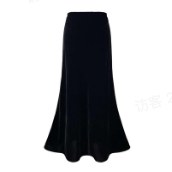 飞书文档 - 图片 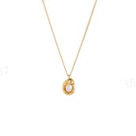 飞书文档 - 图片 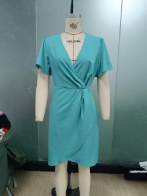 飞书文档 - 图片 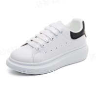 飞书文档 - 图片 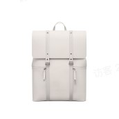 飞书文档 - 图片 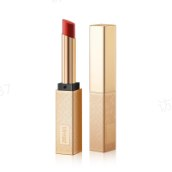 飞书文档 - 图片</td>
<td rowspan="4">商品叠放  商品有文字/水印等 商品叠放 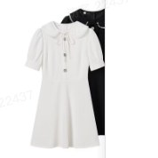 商品叠放 商品有文字/水印等 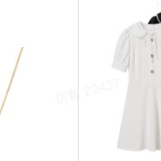 飞书文档 - 图片 商品有文字/水印等 商品有遮挡  商品不完整 商品有遮挡 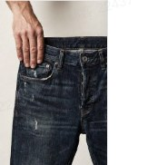 商品有遮挡 商品不完整 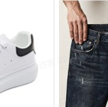 飞书文档 - 图片 商品不完整 商品背景凌乱  商品不清晰 商品背景凌乱 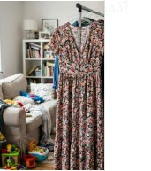 商品背景凌乱 商品不清晰 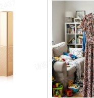 商品不清晰</td>
</tr>
<tr>
<td >&nbsp;</td>
<td >✅商品完整、居中、正面展示，避免商品多件叠放，或者商品不完整</td>
<td >&nbsp;</td>
<td >&nbsp;</td>
</tr>
<tr>
<td >&nbsp;</td>
<td >✅清晰挂拍图/实拍正面图，无手部或者其他东西遮挡</td>
<td >&nbsp;</td>
<td >&nbsp;</td>
</tr>
<tr>
<td >&nbsp;</td>
<td >✅图片无水印/Logo/文字/其他平台水印</td>
<td >&nbsp;</td>
<td >&nbsp;</td>
</tr>
<tr>
<td >素材</td>
<td >要求</td>
<td >正确素材</td>
<td >错误素材</td>
</tr>
<tr>
<td rowspan="4">模特</td>
<td >✅模特站立或坐姿端正，身体无遮挡、无扭曲</td>
<td rowspan="4">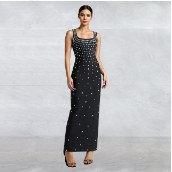 飞书文档 - 图片 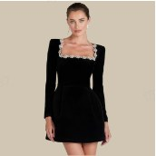 飞书文档 - 图片 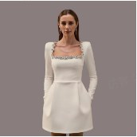 飞书文档 - 图片 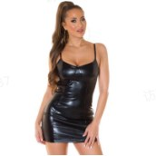 飞书文档 - 图片</td>
<td rowspan="4">模特正脸不清晰  背景太复杂 模特正脸不清晰 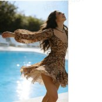 模特正脸不清晰 背景太复杂 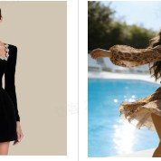 背景太复杂 逆光拍摄  模特图片不清晰 逆光拍摄 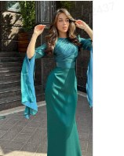 逆光拍摄 模特图片不清晰 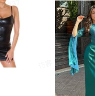 模特图片不清晰</td>
</tr>
<tr>
<td >&nbsp;</td>
<td >✅避免复杂背景（如人群、橱窗、树木）</td>
<td >&nbsp;</td>
<td >&nbsp;</td>
</tr>
<tr>
<td >&nbsp;</td>
<td >✅自然光或柔光拍摄，避免逆光、侧光过强</td>
<td >&nbsp;</td>
<td >&nbsp;</td>
</tr>
<tr>
<td >&nbsp;</td>
<td >✅高清、无压缩</td>
<td >&nbsp;</td>
<td >&nbsp;</td>
</tr>
</table>

## 二、出图避坑指南

### 饰品类

#### 技巧 1  ：添加同类饰品的参考图片/模特图，让  AI  直接参考出图

##### 模特穿戴图：品牌有指定的模特或是  AI  生成的模特不符合品牌调性

#### ✅ 正确做法：

> 1. 使用一键搭配/一键换模特/参考生图等功能时，从卖倍 AI 的官方模特库中选择喜欢的模特，或是上传指定模特；如想生成特定的专属 AI 模特，可联系卖倍 AI 小管家定制（微信：HeyMaybeAI)
>
> 2. 可以在要求描述中填写模特的姿势、动作、表情等

##### 饰品手持图/摆拍图：无法生成想要的场景图效果或是饰品尺寸比例不对

#### ✅ 正确做法：

> 使用一键换商品/参考生图/一键生成主图等功能时，上传同类商品的参考图片（如其他饰品的手持图、摆拍图、场景图、宣传图等）

#### 技巧 2：添加描述让 AI 出图更稳定

##### 耳环：耳环太大像耳罩，太小看不见；戴在头发里、脸颊上，位置错误；双耳不对称

#### ✅ 正确写法（可直接复制）：

> 佩戴一对圆形耳环，直径约1厘米（硬币大小），紧贴耳垂，金属材质有轻微反光。

#### 📌 关键技巧：

- 说明尺寸：用“1cm”、“硬币大小”、“米粒大小”等参照物

- 锁定位置：必须写“耳垂”“耳骨”“左耳/右耳”

- 避免模糊词：不要只说“小巧耳环”，要量化

##### 项链：项链浮在空中，不贴合脖子；链条太粗/吊坠比例失真；看不清细节

#### ✅ 正确写法（可直接复制）：

> 模特佩戴的是一条细链条项链，链条宽1mm，吊坠为心形，长2cm，自然垂落于锁骨中央，金属光泽柔和。

#### 📌 关键技巧：

- 强调贴合：用“贴合锁骨”“自然垂落”“紧贴颈部”

- 描述长度：如“吊坠到胸口”“链条长40cm”

- 搭配服装：穿深色/高领衣服，让项链更突出

##### 戒指：戒指戴在手指外侧、浮空；宽度/厚度不真实，像玩具；手指太粗/太细，比例失调

#### ✅ 正确写法（可直接复制）：

> 右手中指佩戴一枚银色戒指，宽度4mm，戒面镶嵌一颗小钻，紧贴中指第二指节，皮肤真实质感。

#### 📌 关键技巧：

- 指定手指：“中指” “无名指” “左手/右手”

- 说明宽度：戒指宽3–6mm最常见，避免“超宽”等主观词

- 加参考图：上传戒指平铺图，AI会自动对齐比例

##### 手镯/手链：手链像手铐，太粗太紧；悬浮在手腕上方；链条细节丢失；手执手链手镯看起来实物很小，比例不对等

#### ✅ 正确写法（可直接复制）：

> 女性左手腕佩戴一条细金手链，链条宽1.5mm，自然环绕手腕一圈，留有1cm松量，金属光泽细腻，背景柔光。

#### 📌 关键技巧：

- 说明松紧：“留有1cm松量” “贴合但不紧绷”

- 避免“粗” “细”单独使用：改成“链条宽1.5mm”

- 拍特写：聚焦手腕，避免全身图导致比例失真

##### 发饰：发夹位置飘忽（头顶/后脑/耳朵）；大小不符，像玩具；被头发遮挡

#### ✅ 正确写法（可直接复制）：

> 黑发自然披肩，左侧耳上方2cm处佩戴一枚珍珠发夹，直径1.2cm，紧贴发根，珍珠光泽温润。

#### 📌 关键技巧：

- 空间定位：“左耳上方2cm” “头顶正中” “后脑勺下方”

- 固定关键词：“紧贴发根” “嵌入发丝中”

- 发型配合：用“低马尾”“侧分”等露出佩戴位置

### 服饰类

#### 参考生图

##### 技巧 1：一键套用正反排版

<table>
<tr>
<td >- 你看到的这张图（如示例），是典型的正反双面展示排版：左边是衣服正面，右边是衣服背面，呈现衣服完美效果。 - 如果你想让你的商品也用这种排版，不能只传一张衣服图，而是要： - 上传两张商品图：正面 + 背面 - 让 AI 知道“前面要放什么、后面要放什么”</td>
<td >衣服正面图  衣服反面图 衣服正面图 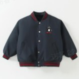 衣服正面图 衣服反面图 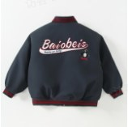 衣服反面图</td>
<td >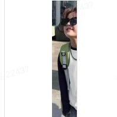 参考生图模版</td>
</tr>
</table>

##### 技巧 2：上传商品图注意事项

<table>
<tr>
<td >- 选定参照图片排版之后，上传商品图一键替换，选定商品图要清晰、完整，不要有手部遮挡物</td>
<td >商品图片不完整  正确案例 商品图片不完整 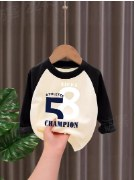 商品图片不完整 正确案例 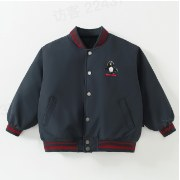 正确案例</td>
<td >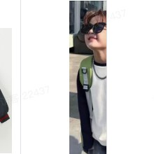 参考生图模版</td>
</tr>
</table>

##### 更多技巧

1. 商品图与模特图的角度最好保持一致，比如背面模特图，那商品图也要是背面图

2. 商品图尽量干净些，比如白底图，透明图

3. 参考排版生图的时候，建议prompt 要说明是参考细节图进行排版 (用户很多生不好的排版图，增加这句说明都可以解决)

4. 对于一些模特动作，可以适当增加生成要求，比如双手插兜

5. 细节图必须一张图就是一个商品，不要把多件商品叠放在一张细节图上

6. 商品图比较复杂或者不好识别的，建议在生成要求增加商品图相关属性描述

## 卖倍 AI 生图

## 一、上传视频素材指南

### 单图/多图生视频

上传一张商品图，AI 自动生成动态展示视频。

但结果是“模特实穿效果展示”还是“奇奇怪怪的自由发挥创意效果”，取决于你传的图！

AI 不会“凭空加模特”——你传的是平铺图，它就做3D展示或者自由发挥；你传的是模特图，它才做“真人穿着”视频。

<table>
<tr>
<td >素材</td>
<td >你希望生成的视频类型</td>
<td >正确素材</td>
<td >错误素材</td>
</tr>
<tr>
<td rowspan="2">商品图片</td>
<td >✅模特穿着/佩戴展示 （如衣服上身、耳环戴耳、包包背在肩上）</td>
<td >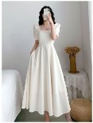 飞书文档 - 图片</td>
<td >没有模特上身  图片不清晰 没有模特上身 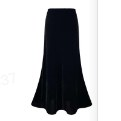 没有模特上身 图片不清晰 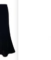 飞书文档 - 图片 图片不清晰</td>
</tr>
<tr>
<td >&nbsp;</td>
<td >✅手持展示 - 局部展示 （如口红、香水、小饰品）</td>
<td >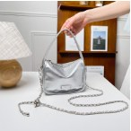 飞书文档 - 图片</td>
<td >没有模特手持  图片不清晰 没有模特手持 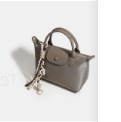 没有模特手持 图片不清晰 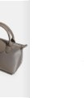 飞书文档 - 图片 图片不清晰</td>
</tr>
</table>

### 视频分析与翻拍 · 使用小技巧（提升出片质量 & 效率）

用“竞品参考视频 + 商品图”生成专属视频？注意这几点，效果更稳、效率更高！

### ✅ 1. 参考视频上传建议

- 不要带抖音/快手等平台水印
→ 水印可能干扰 AI 对画面结构的识别（卖倍 AI 正在开发自动去水印功能，敬请期待）。

- 选择画质清晰、镜头稳定的视频
→ 避免模糊、抖动、快速剪辑的视频，否则AI难以准确提取分镜。

### ✅ 2. 产品图要求

- 目前仅支持上传 1 张商品图（多角度图功能已在排期）

- 建议使用白底平铺图或模特实穿图，确保商品完整、清晰、无遮挡。

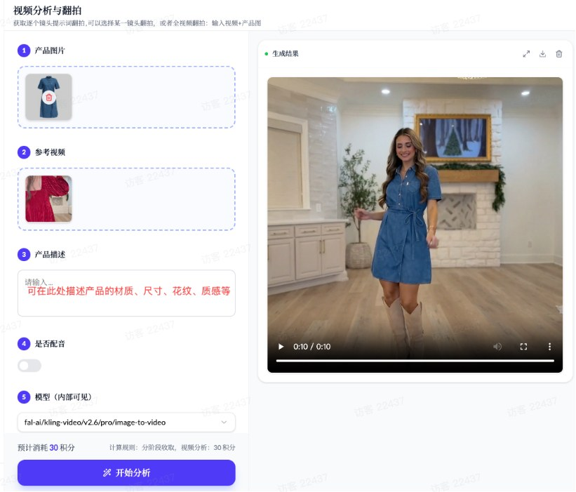

### ✅ 3. 视频生成流程说明

- AI 先分析参考视频：自动拆解镜头数量、时长、节奏、场景。

- 选择需要翻拍的镜头：勾选需要翻拍的镜头画面，点击生成分镜，将自动使用您提供的产品图生成该镜头的画面。

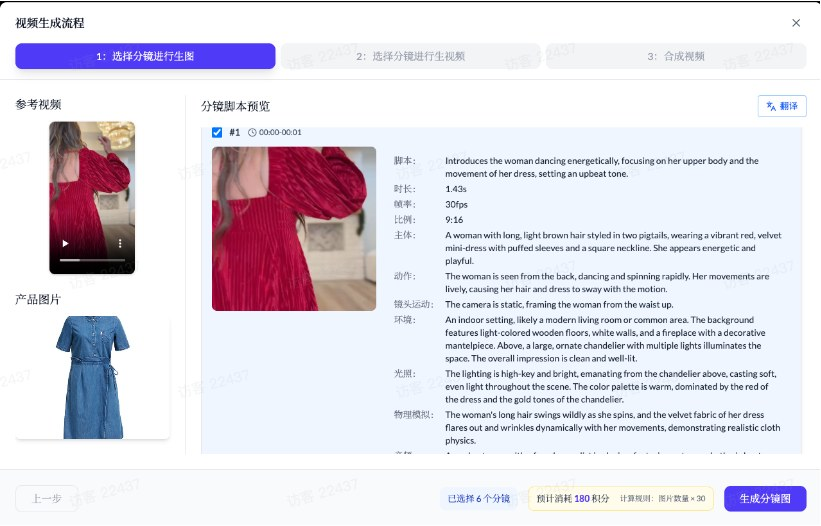

- 生成分镜预览：检查已经生成的分镜图片是否符合要求（特别是商品的一致性）。如不满意，可以选择对应的镜头，单独重新生成。点击生成视频，生成已经选择的分镜片段。

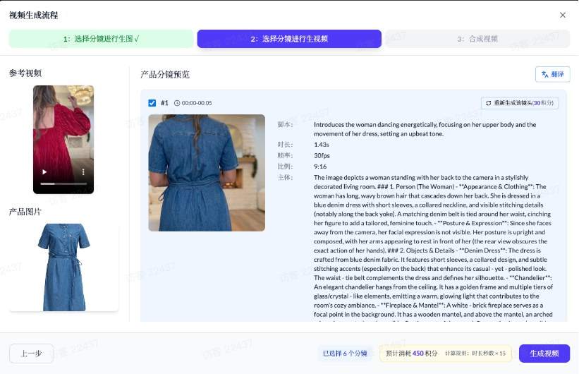

- 选择分镜片段：查看已经生成的分镜片段，如不满意，可以点击重新生成。生成完后，勾选需要的分镜，合并成 1 个视频。

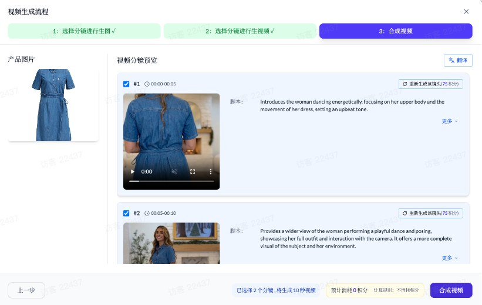

> 🔍 重要提示：
> 请仔细检查分镜预览、分镜图片、以及分镜视频生成效果，确认商品位置、大小、场景是否符合预期。
> 如不满意，可以点击单个图片或者视频进行重新生成。

### ✅ 4. 剪辑与优化建议

- 建议关闭原视频音频
→ 后期可自由配音，成本更低、适配性更强（如加口播、BGM、字幕）。

- 每个镜头默认生成 5秒
→ 如果不需要这么长，可在下载后自行裁剪或调速（如保留2秒关键帧即可）。

- 生成后务必预览整体效果
→ 不满意的片段可手动删除（未来我们将上线内置剪辑功能，支持一站式编辑）。

### 💡 一句话总结：

> 传干净视频 + 清晰商品图 → 检查分镜 → 关闭原音 → 选择关键镜头 → 高效出片！

## 二、AI生视频如何写描述语？

“不用写复杂提示词！一句话告诉AI你想拍什么，它就能生成视频”

你只需要描述：「谁」+「在哪里」+「干什么」，AI 就能自动帮你生成精准视频。

我们内置了电商专业的提示词，你不需要懂“运镜”“光影”，只要说清楚产品和场景就行。

<table>
<tr>
<td >你传的图片</td>
<td >你想生成的视频效果</td>
<td >你该怎么描述？</td>
</tr>
<tr>
<td > 飞书文档 - 图片</td>
<td >- 模特自然走动、转头微笑、展示衣服细节</td>
<td >- 模特在咖啡馆里慢慢走动，边走边微笑，衣服随着走动轻轻飘动</td>
</tr>
<tr>
<td >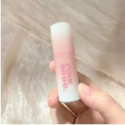 飞书文档 - 图片</td>
<td >- 手部轻转口红，展示颜色和质地</td>
<td >- 手轻轻转动口红，展示口红颜色和质地，背景虚化</td>
</tr>
<tr>
<td >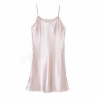 飞书文档 - 图片</td>
<td >- 3D旋转展示，多角度呈现面料垂感</td>
<td >- 裙子缓慢旋转，展示面料光泽和垂坠感</td>
</tr>
</table>

> 💡 关键提示：
>
> - 如果图片自带背景（如街景、室内），请强化描述这个场景，不要描述其他不相关的环境。
>
> - 不需要写“镜头语言”或“氛围”，AI 会根据你的描述自动匹配最合适的风格。

### ✍️ 描述技巧（三步法，人人能用）

1. 谁？ → 商品 or 模特

> “模特穿这件T恤” / “这瓶香水放在桌上”

2. 在哪里？ → 场景

> “在阳光明媚的咖啡馆” / “在白色摄影棚里”

3. 干什么？ → 动作或状态

> “转身微笑” / “轻轻摇晃瓶身” / “缓缓旋转展示”
>
> ✅ 举例：
> “模特穿这件红色连衣裙，在海边散步，风吹起裙摆，自然微笑。” → AI 会自动生成：海边场景 + 模特走动 + 裙摆飘动 + 微笑表情
